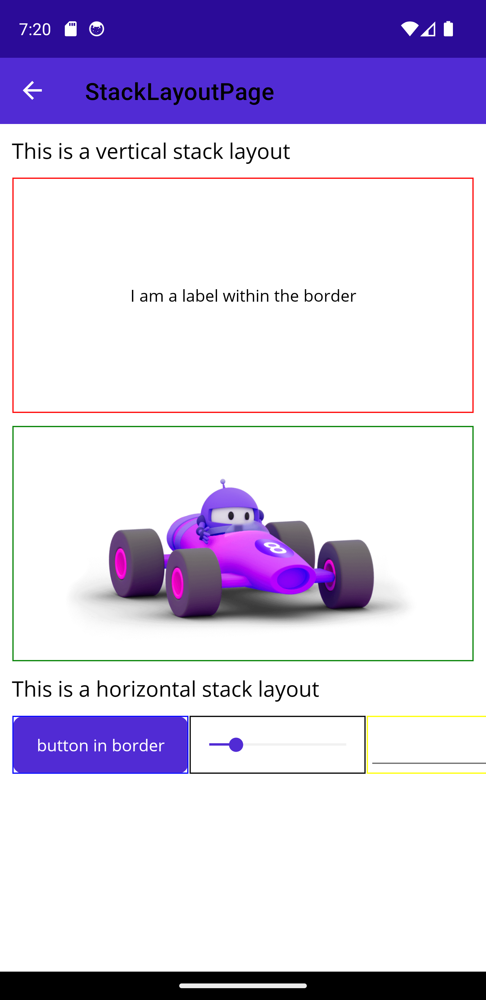
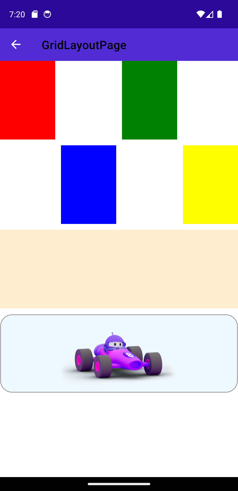
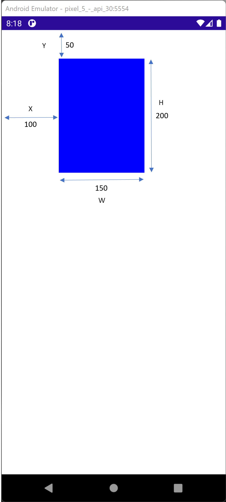
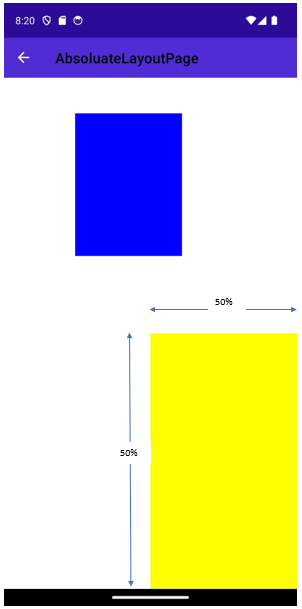
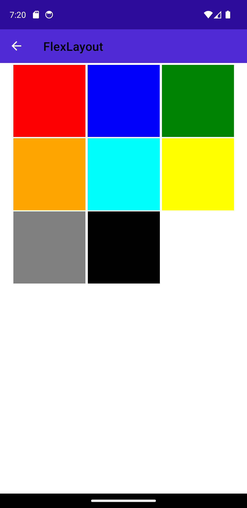
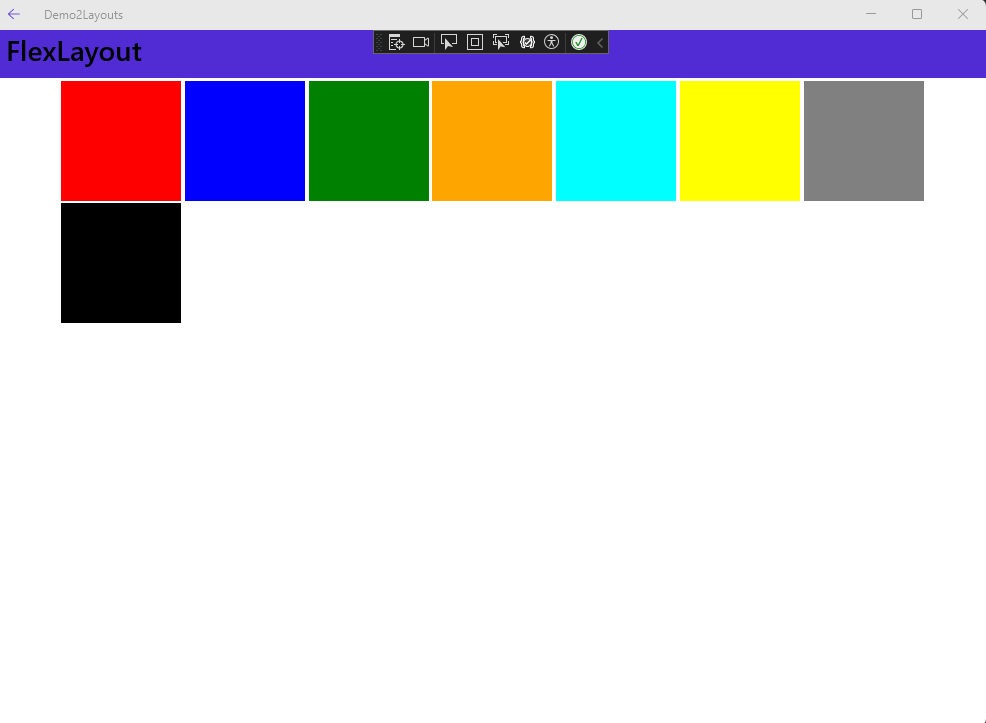

[Demo made in class](https://github.com/AppDevIII-W24-Code/Demos/tree/632ce254f018c06db0b29a42a52228b7ad6d41a9/Demo2Layouts)

## Vertical and Horizontal Stack Layouts

- Similar to the `StackLayout` existent older .NET frameworks, the `VerticalStackLayout` and the `HorizontalStackLayout` organize items in a one-dimensional stack.
  - Note: Although the  `StackLayout` is still supported in .NET MAUI, Microsoft recommends using those optimized Layouts.
- The bounds of all the child of those layouts will be overridden so that it appears in the one-dimensional stack in the order it was added.
- The `VerticalStackLayout` (or `HorizontalStackLayout`)  fills its parent by default
- Here are a few attributes to explore:
  - `Spacing`: Controls the space between the children
  - `Padding`: Controls the size of the boundaries between the layout and its **children**
  - `Margin`: Controls the size of the boundaries between the layout and its **parent**
  - **For the children:**
  - `HeightRequest`: Desired height for the element. (May not be applied)
  - `WidthRequest`: Desired width for the element
  - `VerticalOptions`: how the element is vertically positioned within the parent. Can be any of those `LayoutOptions`:
    - `Start`
    - `End`
    - `Center`
    - `Fill`
  - `HorizontalOptions`: similar to the vertical options but for the horizontal axis.
  - `VerticalStackLayout` and `HorizontalStackLayout` can be nested:

## Grid Layout

- The `Grid` layout was introduced by older .NET framework (Wpf and Xamarin)

- Divides the screen into a two-dimensional grid

- By default the Grid is 1x1

- Here are a few properties to explore:

  - `ColumnDefinitions`: defines the `Width` of each column of the grid, ex: `"10,*,auto"`
  - `RowDefinitions`: defines the `Height` of each row of the Grid separated by a `"10,10,10"` 
  - There are three possible `GridUnitType`
    - `Absolute`: the row height/width in pixels
    - `Auto`: Automatic size based on other rows/columns sizes. Microsoft discourages from having too many elements sized with `Auto` for performance issues.
    - `Star`: Allocated proportionally, ex: `2*,*` , this means the first will be double the second in size.

  - `ColumnSpacing` : Controls the spaces between columns

  - `RowSpacing`: Controls the spaces between rows

  - `Padding`: Controls the space between the edges of the Grid and its children.

  - **For the children:**

  - `Grid.Column`: Sets the start position of the child to a `Column` index, starting from 0 (also default value)

  - `Grid.Row`: Sets the start position of the child to a `Row` index, starting from 0 (also default value)

  - `Grid.ColumnSpan`: The number of columns on which the child will span.

  - `Grid.RowSpan`: The number of rows on which the child will span: For example the MAUI bod image is spanning on 4 columns (see below)

  - `VerticalOptions`: Same as the Stack layouts

  - `HorizontalOptions`: Same as the Stack layouts

  - **Note about text alignment**:  By default text is wrapped in boundaries which are then aligned relative to the grid. To obtain the correct alignment, the Text has to be aligned relative to those parent boundaries using `TextAlignment` (`Center`,`End`,`Start`)  

    

## Absolute Layout

- Used to create layouts based on device coordinates or application proportional or a combination of both.

- All elements will be explicitly defined:

  - X : Horizontal start position of the element. 
  - Y: Vertical start position of the element
  - Width
  - Height

- Device coordinates are absolute measures of pixels: 

  - example  X =100  , Y=50 Height=150, Width =200:

    

- Application proportional are percentage of the screen size (value from 0 to 1) 

  - example "1,1,0.5,0.5" :

    

        
        

    

    

- `AbsoluteLayoutFlags`:

  - `All`:  X, Y, W, H are proportional (value from 0 to 1)
  - `None` : X,Y, W, H are absolute (in pixels)
  - `SizeProportional` : W,H are from 0 to 1.
  - `PositionProportional`: X,Y are from 0 to 1:

    - (0,0) will be aligned with the top right corner
    - (0.5,0.5) will be in the center
    -  (1,1) will be in the bottom right corner
    - Any other value is extrapolated between those positions

      [^1]: Refer to [this](https://askxammy.com/working-with-absolutelayout-in-xamarin-forms/) link for more information.

  - `HeightProprtional`, `WidthProportional`, `XProportional`,`YProportional`

## Flex Layout

The Flex Layout is introduced by MAUI as a way to arrange elements vertically or horizontally and adapt based on the available screen size. It may be useful if you wish that your layout works for both mobile and desktop applications.

Here are a few properties to explore:

- `Direction` : The main axis on which to align the items (possible values: `Column`, `Row`, `ColumnReverse` , `RowReverse`)

- `Wrap`: indicates if the items should be laid on multiple axis (values: `NoWrap`, `Wrap`, `Reverse`)

- `AlignItems`: Defines how the items are distributed in the parent **within the same axis** (values: `Start`, `End`,`Center`,`Stretch`)

- `AlignContent`: Defines how the items layed on multiple lines are distributed in the parent 

  

  
  

  

      
      
  

  
  

 
