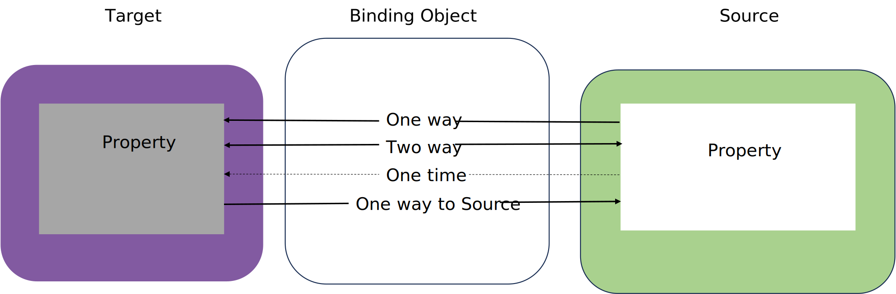

- In C#, data bindings allow properties of two objects to be coupled, i.e: to change together.

  - A change in one object causes a change in the other.

  - One is called the *source* and the other is the *target*.

  - Data Binding involves a *binding object* which transfers the data from source to target and/or vice versa.

  - The target property must be a `bindable` property: which means that the target object must derive from `BindableObject`.

  - The online `.NET MAUI` documentation indicates which properties are bindable properties.

    Example: A property of `Label` such as `Text` is associated with the bindable property `TextProperty` ([source](https://learn.microsoft.com/en-us/dotnet/api/microsoft.maui.controls.label?view=net-maui-7.0)).

- `.NET MAUI` provides a markup extension to provide binding through `xaml`.

  - There are multiple ways to set the `BindingContext` of the target object. Sometimes it’s set from the code-behind file, sometimes using a `StaticResource` or `x:Static` markup extension, and sometimes as the content of `BindingContext` property-element tags.


|  |
| :----------------------------------------------------------: |
|                     *Data Binding Mode*                      |


## XAML-to-XAML Binding

Values of attributes from one `XAML` UI element can be bound to other attributes from the same Content Page. Bindings can be set on any class that derives from `BindableObject`

**How does it work?**

- Use of the Markup extension `{Binding ...}`
- You may either use of the `BindingContext` to set the source
- You may alternatively specify the source directly in the Target and use the `Path` to bind to a particular property.
- Refer to the following example:

```xaml
<Slider x:Name="slider"
        Maximum="360"
        VerticalOptions="Center" />
<Label  Text="Rotating text"
        Rotation="{Binding Source={x:Reference slider},Path=Value}"/>
```

Refer to the [documentation](https://learn.microsoft.com/en-us/xamarin/xamarin-forms/app-fundamentals/data-binding/basic-bindings) from more information.

**Binding Modes**

- A single view (page) can have data bindings on several of its properties. However, each view can have only one `BindingContext`, so multiple data bindings on that view must all reference properties of the same object.

- Each property has a different relation with the UI element it is bound to. The `Mode`

  property of `Binding`, which is set to a member of the `BindingMode` enumeration and can have one of the following values:

  - `Default`
  - `OneWay` values are transferred from the source to the target.
  - `OneWayToSource` values are transferred from the target to the source.
  - `TwoWay` values are transferred both ways between source and target.
  - `OneTime` data goes from source to target, but only when the `BindingContext` changes.

**String formatting**

You may bind values to the Text property of a UI element such as a `Label` while keeping a specific format, for example: if you wish to represent a date as such: *"Today: October 23, 2023"*


```xaml
<VerticalStackLayout BindingContext="{x:Static sys:DateTime.Now}">
    <Label Text="{Binding StringFormat='Today: {0:MMMM dd, yyyy}'}" />
</VerticalStackLayout>
```

For more complex translations of the bound values, use [Converters](https://learn.microsoft.com/en-us/dotnet/communitytoolkit/maui/converters/).


### XAML-to-C# Binding

To create a binding between the XAML and the code behind of a Page, you simply need to specify the `BindingContext` inside the constructor of the `ContentPage`.

Let's use the example of the `PostPage` from Lab1, instead of imbedding the source of the image directly in the `XAML`,  we could create a public property in the code behind to bind the image in the `XAML`:

`PostPage.xaml.cs`:

```c#
namespace Lab1.Views
{
    public string ImageSource {get; set;} = "fall.png" //Added
    public partial class PostPage : ContentPage
    {
            public PostPage()
            {
                InitializeComponent();
                BindingContext = this; // Added
            }
    }
}
```

`PostPage.xaml`:

```xaml
    <ScrollView>
        <VerticalStackLayout Padding="10" Spacing="5" VerticalOptions="Center">
            <!-- content...-->
            <Border BackgroundColor="Black" Padding="5">
                <Image Source="{Binding ImageSource}"  Aspect="AspectFit" MaximumHeightRequest="500"/>
            </Border>
            <!-- content...-->
            
        </VerticalStackLayout> 
    </ScrollView>

```

> You might wonder, what have we gained by using binding in this example? 
>
> Not much for now, but as we make the `PostPage` more dynamic, having access to the variable properties in the code behind will make our lives much easier.


### INotifyPropertyChanged

As per Microsoft [documentation](https://docs.microsoft.com/en-us/dotnet/desktop/wpf/data/how-to-implement-property-change-notification?view=netframeworkdesktop-4.8), to notify the UI that a property has been updated dynamically, the following has to be applied to the model class:

- The UI elements should use `Binding` to connect to the properties in the class.
  - A property requires a getter to provide a value to the UI element.
  - A property requires a setter to send a value from the UI to the class.
- The class with bound properties must implement `INotifyPropertyChanged` interface.
- Declare an event `public event PropertyChangedEventHandler PropertyChanged;` .
- The property must be a full property with a private backing field and a full setter and getter.
- Create the `OnPropertyChanged` method to raise the event. (code provided in the documentation above).
- Finally, `OnPropertyChanged();` should be called in the setter of the property that is required to update the UI.
- Each property that is required to change a UI value should follow the process.

> Check this [link](https://learn.microsoft.com/en-us/dotnet/api/system.componentmodel.inotifypropertychanged?view=net-7.0) for more details in `.NET MAUI`.


In the .NET MAUI framework, you will realize that the `ViewModel` is nothing more but a class that implements this interface and that has a few public properties bound to the views and that fire the `OnPropertyChanged`event every time the model or the view were changed.

## Resources

1. https://www.techtarget.com/whatis/definition/data-binding

