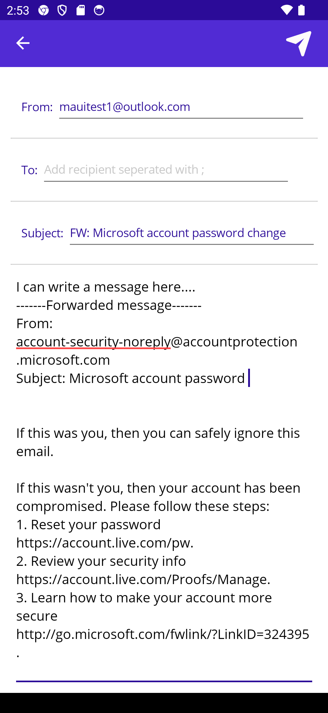
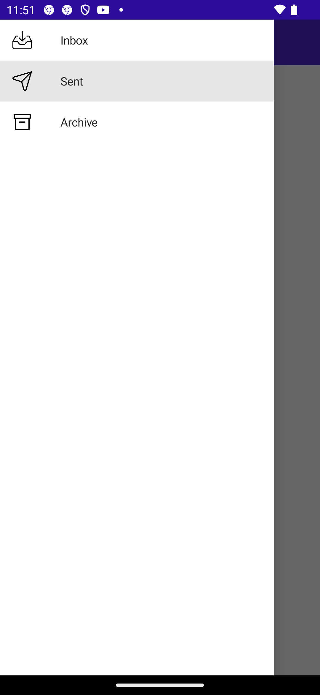
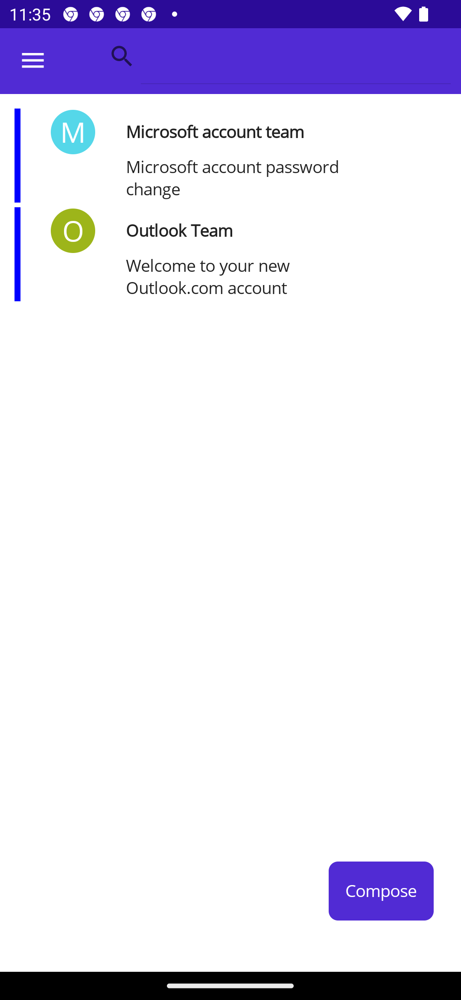
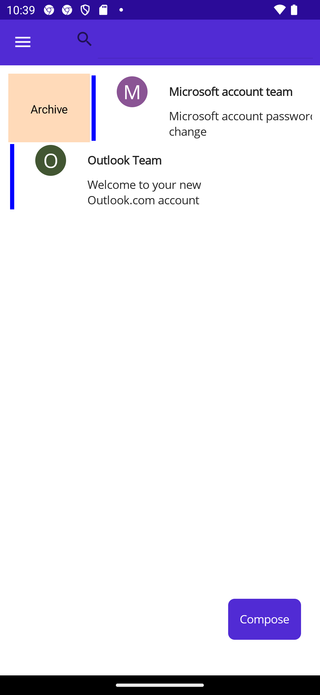
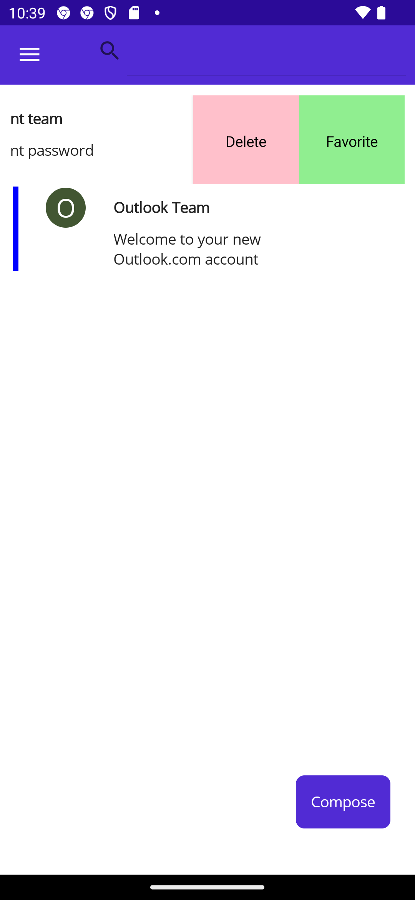
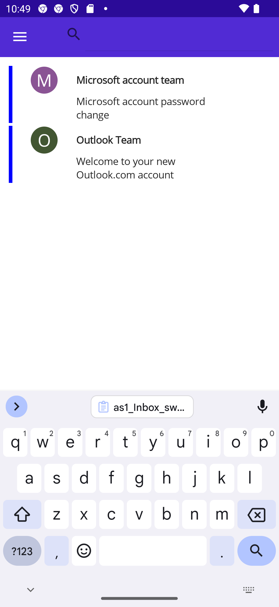
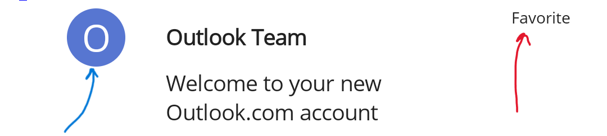
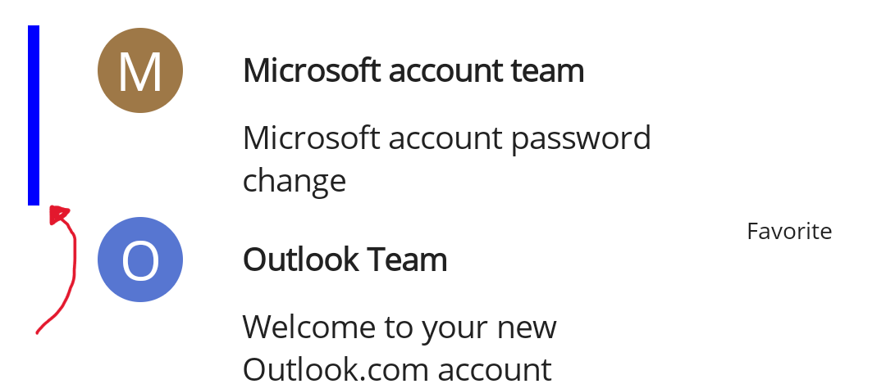
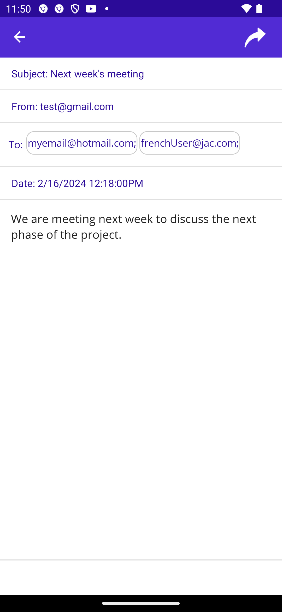
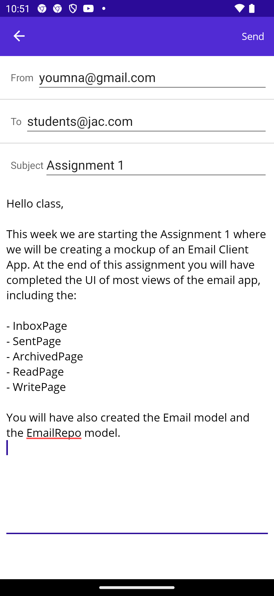

* **Worth**: 10%
* 📅 **Due**: March 18, 2024 @ 23:59.
* 🕑 **Late Submissions**: Deductions for late submissions is 10%/day. 
  *To a maximum of 3 days. A a grade of 0% will be given after 3 days.*
* 📥**Submission**: Submit through GitHub classroom.


## Project Preparation

- Check the `GitHub` classroom link shared with you on your section's Teams channel and accept the assignment.
- Once your private repo is created, clone it to your computer.
- The repo should contain a  `.NET MAUI App`  starter code using .NET Core 7.0
- Create a new `.NET MAUI App` project in the cloned folder using the following specifications:
- Organize your Views inside a folder **Views**
- Organize your C# classes inside a folder named **Models**
- Organize your data repos classes inside a folder named **DataRepos**
- Organize your services inside a folder named **Services**
- Organize your converters inside a folder named **Converters**


## Objective

In this first assignment, you are tasked with creating a simple Email Client App offering various functionality. This is first milestone of the assignment, you will have to create the various views and models used by your app. The app will not be fully functional but will provide a starting point for the following assignment. 

- Design a mockup Email app using the .NET MAUI framework
- Design and implement a view using a`CollectionView`
- Use the `INotifyPropertyChanged` interface
- Use shell navigation 
- Create models 
- Use data binding 
- Use converters
- (optional) Use templated views


## User Needs

The Email app must:

- Display a list of emails.

- Allow the user to switch between various views (Inbox, Archive, Sent, Bin) **Note: The additional views will be completed in the next milestone.**

- Offer a search function to search through the emails titles, contents and senders.

- Differentiate visually between Read/Unread emails 

- Differentiate visually between favorite/ non-favorite emails

- Offer a swipe function to archive, add to favorite or delete emails

- Offer tap functionality to display a detail view of the email

- Offer a view to write new emails

- Offer a functionality to forward emails

  

**You do NOT have to implement:**

- Authentication of a user
- Connection to a mail server
- Send/Receive emails from a server

> To mockup data use a static `DataRepo`


## User stories

In a separate word document, PDF or markdown file 

- Write at least 5 simple user stories to translate the user needs above
- The title of your user stories should follow the format: *As a user, I want to* 
- Each user story should be accompanied with an **acceptance criteria**


### Model Classes

Organize the following software requirements and related them to the user stories you have created

Create an `Email` model with the following specifications:

1. Implements the `INotifyPropertyChanged`from **`System.ComponentModel`**

- Implement the event `PropertyChanged`
- Install the NuGet package ***PropertyChanged.Fody*** which will auto generate notification on property changes. This way you will not need to create and call the `OnPropertyChanged()` method in every setter.


2. **Public** properties of this model are: 

| Name               | Type                                        | Description                                                  |
| ------------------ | ------------------------------------------- | ------------------------------------------------------------ |
| `Id`               | `string`                                    | Unique identifier for an email                               |
| `Date`             | `DateTime`                                  | Date and time of sending the email                           |
| `Subject`          | `string`                                    | Subject of the email                                         |
| `Body`             | `string`                                    |                                                              |
| `SenderAddress`    | `MailAddress `(add using `System.Net.Mail`) | The email address of the sender                              |
| `RecipientAddress` | `List<MailAddress>`                         | The email addresses of the recipients                        |
| `IsRead`           | `bool`                                      | Flag used to decipher between read and unread emails         |
| `IsFavorite`       | `bool`                                      | Flag used to decipher between starred and regular ones       |
| `IsArchive`        | `bool`                                      | Flag used to decipher between archived emails and non-archived |

3. **Methods**:

- `public Email GetForward()`: This method returns a new Email with a forwarded body and subject as such:

  


- Feel free to add methods and properties that are useful for other pages you've defined. In a future milestone, we will be adding the concept of Folder to organize emails.


## Data Repo

Create a **non-static**  `EmailRepo` class 

We will use the `EmailRepo` class as a static variable shared across all views. It is important **that any modifications done to the emails** be done through this `Repo` to avoid conflictual updates across the views. 

This class will eventually be using the email service to download emails, send them or modify their containing folder.

1. Implements the `INotifyPropertyChanged`from **`System.ComponentModel`**

- Implement the event `PropertyChanged`
- Install the NuGet package ***PropertyChanged.Fody*** which will auto generate notification on property changes. This way you will not need to create and call the `OnPropertyChanged()` method in every setter.

2. **Public property**

- `ObservableCollection<Email>`: `Emails`: Represents the entire emails in the inbox


3. **Private methods:**

- `void AddTestData()`: A method which creates mock data.

  **Note:** This method is temporary to help you test the first milestone of this app. We will eventually remove it.

4. **Public methods:**

- `public void MarkRead(Email email)`:  Sets the `IsRead` property to property to `true`
- `public void MarkUnread(Email email)`: Sets the `IsRead` property to property to `false`
- `public void AddFavorite(Email email)`:Sets the `IsFavorite` property to property to `true`
- `public void Archive(Email email)`: Removes the email from the Emails list. **We will later use the email service to mark the email for archive on the mail server.**
- `public void Delete(Email email)`: Removes the email from the Emails list. **We will later use the email service to mark the email for deletion on the mail server.**

- `public IEnumerable<Email> SearchFromString(string filterString)`: Returns all emails containing the `filterString`

  > Hint: Use a Linq method to search for emails whose subjects, sender emails or body contain the filterString.

5. Create a static instance of this class in the `App.xaml.cs`:

```csharp
public static EmailsRepo Inbox = new EmailsRepo();
```

6. The Email list can now be accessed in the views (code behind) using the ` App.Inbox.Emails`.

   

## Helpful Tips

A few new concepts are introduced in this design:

#### **Value Converters**

**What are "Binding Value Converters"?**

- .NET Multi-platform App UI (.NET MAUI) data bindings usually transfer data from a source property to a target property, and in some cases from the target property to the source property.

- This transfer is straightforward when the source and target properties are of the same type, or when one type can be converted to the other type through an implicit conversion.

  **When that is not the case, a type conversion must take place.**

To achieve this task you need to write some specialized code in a class that implements the `IValueConverter` interface. Classes that implement `IValueConverter` are called *value converters*, but they are also often referred to as *binding converters* or *binding value converters*.

***Example\***

*(Do not type this code into your project. This is only for explanation purpose and will be discussed in class)*

- Suppose you want to define a data binding where the source property is of type `int` but the target property is a `bool`.

- You want this data binding to produce a `false` value when the integer source is equal to 0, and `true` otherwise. This can be achieved with a class that implements the `IValueConverter` interface:

  ```csharp
  public class IntToBoolConverter : IValueConverter
  {
      public object Convert(object value, Type targetType, object parameter, CultureInfo culture)
      {
          return (int)value != 0;
          /*  - 'value' is the passed property from xaml, hence requires casting
              - Casting could fail, so adding a try/catch with a default return value 
               is a good programming practice to avoid app crashes */ 
      }
      public object ConvertBack(object value, Type targetType, object parameter, CultureInfo culture)
      {
          return (bool)value ? 1 : 0;
          /*    Converting back to original value. 
              Not all conversions are resersable */
      }
  
  ```

  How to use the created converter class in your view `xaml` code?

  ```xml
  <!-- 1. Add the converters namespace to the XAML markup extensions -->
  <ContentPage ...
               xmlns:converters="clr-namespace:ProjectNamespace.Converters"
               ...>
      <StackLayout Padding="10, 0">
          ...
  <!-- 2. Assign the 'Converter' property  -->
          <Button Text="Save"
                  IsEnabled="{Binding Value, Converter={converters:intToBool}}" />
          ...
      </StackLayout>
  </ContentPage>
  ```

  

#### Dependency injection

In this assignment you will be reading/writing emails displayed in a list of email. The list view of the emails must be able to pass data to the read and write pages.  

Given that data must be sent from an origin class *`A`* to a destination class *`B`*.

- **First Approach:** Create a public property or method in destination class `B`. Class `A` would create an instance of of class `B` and use the property or method to set or pass the data to the instance. This approach is acceptable if the data is not required to create the object of type class `B`:

  ```csharp
  var b = new B();
  
  b.Data = data; // b.SetData(data)
  ```

  

- **Second Approach:** Create a constructor in class `B` that accepts the data as an arguments. The constructor will be responsible for saving the data for later use if needed.

  ```csharp
  var b = new B(data);
  ```

  The second approach is preferred if the object B requires the data to be constructed.


## UI Design 

1. Create the following pages:

   - `InboxPage`  (which will display emails in the inbox)
   - `SentPage` (empty for this milestone, will be the placeholder for the list of sent emails)
   - `ArchivePage`  (empty for this milestone, will be the placeholder for the list of archived emails)
   - Feel free to add more pages that an email app should contain.
   - `ReadPage` (displays the details of the email)
   - `WritePage` (displays a form to write a new email)

2. Use a flyout menu or a tab bar to navigate between the various email folder pages:

   

3. In the Inbox view, you should include an `SearchBar` and a search button within the `NavBar`, this will serve as a search bar to filter out emails:

   > Hint: Use `Shell.TitleView` to include your search bar

4. In the inbox view, use a `CollectionView` of a collection of email items

5. Use a `<SwipeView>` as a `DataTemplate` of the `CollectionView.ItemTemplate`:

   - `SwipeView.LeftItems` should include a single `SwipeItem` titled "Archive"

   - `SwipeView.RightItems` should include two `SwipeItem`s titled "Delete" and "Favorite" as shown below.

   - Add new event handlers for the `Clicked` event of every Swipe Item.

   - Within each event handler you must cast the `sender` object as a `SwipeItem` and use the `BindingContext`:

     ```csharp
     var swipe = (sender as SwipeItem);
     Email item = swipe.BindingContext as Email;
     ```

   - To perform the actions use the Repo's methods: 

     - `AddToFavorites()`

     - `Archive()`

     - `Delete()`

       

6. Use a `Grid` to define the layout of the `CollectionView.ItemTemplate`

7. Add a `<GestureRecognizer>` on the `Grid` :

   - Add a `TapGestureRecognizer`

   - Add a new event on the `Tapped` event to get the clicked email

     > Hint: In the event handler, cast the sender into a Grid object similarly to the example of the SwipeItems.

   - When tapped a new `ReadPage` should be created the selected email should be passed as argument.

     

**Figure 2: Inbox Page** 




6. Add a `Label` with Text "Favorite" and who's visibility is bound to the `IsFavorite` boolean of the `Email` model

7. Use a rounded `Frame` or `Border` with the first character of the `DisplayName` as the user icon. 

   *For example: Letter "O" for Outlook Team*

   

   > Hint: You must use a converter within the Binding of the user icon label. This converter must return the first character of the display name:

8. (Optional) Use randomly generated background colors for the `Frame` of the user icon.

   > Hint: You must a converter and a Random number generator.

9. Unread emails (never tapped) should appear differently. Feel free to use any method to distinguish them `IsRead`

   > Hint: Use Converters to translate the IsRead property of an email into a UI attribute such as a color or a text style, etc..

   

**Figure 3: Unread emails are marked with a blue line, read emails have a transparent line** 



9. The "Compose" button should asynchronously push a new `WritePage`:

   

   ### ReadPage

   **Code behind:**

   1. The constructor of the `ReadPage` should receive an `Email` object as argument.
   2. The email must be marked as `Read` 
   3. Use this email as `BindingContext`

   **XAML:**

   3. Contains:
      - A `Label` to indicate the `Subject`
      - A `Label` to indicate the `SenderEmail.DisplayName`
      - Labels for each `RecipientEmail`:
        - Hint: Use `BindableLayout` or a `CollectionView`with the `ItemsSource` set to the list of recipients.
      - A `Label` to indicate the date
      - A `Label` or `Editor` to dsiplay the body of the email.
      - Feel free to improve the design to your linking.

**Figure 4: ReadPage template ** 




4. Implement a "Forward" button to:
   - Use the `GetForward()` to get the forwarded email. 
   - Push a new `WritePage` provide a forwarded email as input

### WritePage

**Code behind:**

1. The constructor of the `WritePage` might optionally receive an email as input, if the email was forwarded.

   > Hint: Create a default value for the passed argument and use conditional logic in the constructor.

2. Initialize a public readonly property `EmailAddress` called "CurrentAddress". Set its value to a mock email for now. 

   **Note: we will later replace this with a real email provided by a mail service**.

3. Initialize a public `Email` property to bind the various entries  called "EditEmail". Set the `SenderEmail` to the email you defined previously.

3. The `EditEmail` can be used as a Binding context for the various entries.

   

   **XAML:**

4. Contains an entry bound to the CurrentEmail

   - Should be `ReadOnly`

   - Bind it to the `SenderEmail`

   - Contains a entry for the recipients emails:
     - The `Keyboard` should be set to `Email`
     - Assume the inputted emails are separated by "';'" 
     - Use the `Completed` event to parse the emails entered by the user

5. Contains an entry for the Subject

6. Contains an `Editor` :

7. Set the `HeightRequest` to at least 500:

   **Figure 5: WritePage template**  




 


## Additional notes

- I suggest you draw a quick wireframe of your app to help you define the views and their interactions with the model
- For all image button icons, download them from [flaticon](https://www.flaticon.com/) or [icon8](https://icons8.com/icons/set/library) 
- Create your layouts with hard coded data for simplification 
- Keep your code behind clean! (As little logic as possible)


## Grading Rubric

| Evaluation Criteria   | Details                                                      | Worth (/100) |
| --------------------- | ------------------------------------------------------------ | ------------ |
| **UI Design**         | All requested elements available. 5<br /><br />Use of at least a Tab Bar or a Flyout menu 2<br />Use of at least 1 `CollectionView` 2<br />Use of application resources for UI styling 1<br />Use of converters 5 .<br />Use of swipe view 3 .<br />Use of tap gesture recognizer 2.<br /> | 20           |
| **Views code behind** | Correct use of dependency injection 5.<br />Use of data binding 15.<br />Proper string formatting when required  5.<br />Use of the Data Repo to interact with the data 10.<br /> | 35           |
| **Model Classes**     | Proper class design and use of OOP pillars.<br />`Email` class 15<br />`EmailRepo`  class 20 | 35           |
| **User stories**      | User stories are written from the perspective of the end user. User stories are simple and concise. Every user story has a clear acceptance criteria. | 5            |
| **Functionality**     | App does everything and works as expected.<br />App does not crash..<br />A user can view a list of email, send an email, delete and archive an email, mark as favorite... | 10           |
| **Coding Style**      | Use of comments.<br />Use of naming conventions.<br />Avoid the use of magic numbers: define constants when needed. | 3            |
| **Name & ID**         | At the top of all submitted files: provide your name, student ID and assignment number. | 2            |

