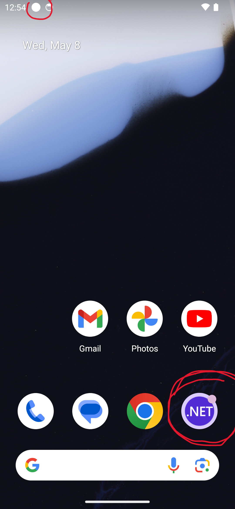
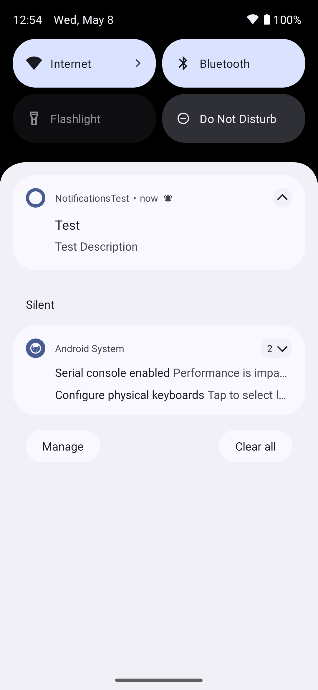
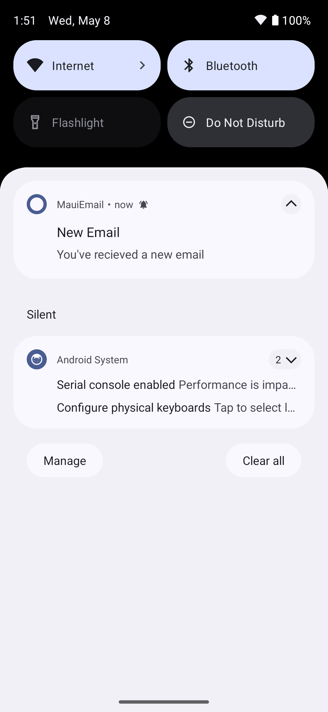

* **Worth**: 5%
* 📅 **Due**: May 16, in class.
* 🕑 **Late Submissions**: Deductions for late submissions is 10%/day. 
  *To a maximum of 3 days. A a grade of 0% will be given after 3 days.*
* 📥**Submission**: Submit through GitHub classroom.


This Assignment, will be completed in class as the last lab of the course. We will complete some of the functionality of the **MauiEmail** app. 

### Objectives:

- Create a Mail Service which connect with a mailing server
- Download emails and send emails asynchronously by using `MailKit`
- Subscribe to a server-side event (new email received)
- Send push notifications by using `Plugin.LocalNotification`


## Setup

- Accept the assignment and clone the repo:
  - [Section 1](https://classroom.github.com/a/e6mNPcOo)
  - [Section 2](https://classroom.github.com/a/GKqMcALy)

- For this assignment you may re-use your Assignment 1 code or use the starer code found [here](https://github.com/AppDevIII-W24-Code/Labs-solutions/tree/main/MauiEmail).
- Create a dummy email address on outlook:
  - Go to [Microsoft Outlook website](https://www.microsoft.com/en-us/microsoft-365/outlook/email-and-calendar-software-microsoft-outlook?rtc=1)
  - Click Create free account
  - Create a new email address
  - Create a new password that you can easily remember
  - Fill in the first name, last name (you can enter something like Mail Kit Test or something along this)
- Once logged in to your new email account:
  - Select **Settings**> **Mail**> **Sync email**.
  - Under POP and IMAP> Let other devices and apps use POP > make sure the toggle is on.
  - Make sure this option is checked: Let apps and devices delete messages from Outlook


## MailKit

[MailKit](https://github.com/jstedfast/MailKit) developed by [Jeffrey Stedfast](https://github.com/jstedfast) and is a cross-platform mail client library which uses [MimeKit](https://github.com/jstedfast/MimeKit). It offers authentication functionality as well as emailing functionality using POP3 protocol, Imap and Smtp. It is relatively easy to use for emailing. 

1. Install the Nuget Package: `MailKit` **version:** 4.3.0

2. Create a folder called `Config` 

3. Add a static class called `MailConfig` 

4. Add the following using:

   ```csharp
   using MailKit.Security;
   ```

5. Add the following public properties and set their values which are based on [Outlook's settings](https://support.microsoft.com/en-us/office/pop-imap-and-smtp-settings-for-outlook-com-d088b986-291d-42b8-9564-9c414e2aa040):

   - `Email`: the email address you just created
   - `Password`: the password you just created
   - `ImapHost`: **outlook.office365.com**
   - `ImapPort`: **993**
   - `ImapSocket`: `SecureSocketOptions.SslOnConnect` (part of `MailKit.Security`)
   - `SmtpHost`: **smtp-mail.outlook.com**
   - `SmtpPort`: **587**
   - `SmtpSocket`: `SecureSocketOptions.StartTls` (part of `MailKit.Security`)

**Modification of the Email model**

6. Since the mail kit uses [MimeMessage](https://mimekit.net/docs/html/T_MimeKit_MimeMessage.htm) we need a way to convert them into our `Email` model.

7. Add a string property `Id` to the `Email` model:

   ```csharp
   public string Id { get; set; }
   ```

   

8. In your `Email` model add another constructor which takes a   `MimeMessage`  and a `MailKit.UniqueId` as parameter:

   ```csharp
   using MimeKit;// Add the following using
   
   namespace MauiEmail.Models
   {
       public class Email : INotifyPropertyChanged
       {
           // ...your Email model from Assignment 1
           public Email(MimeMessage mimeMessage, MailKit.UniqueId uniqueId)
           {
               this.Id = uniqueId.ToString();
               this.Date = mimeMessage.Date.DateTime;
               this.Subject = mimeMessage.Subject;
               this.Body = mimeMessage.HtmlBody;
               this.SenderAddress = new MailAddress(mimeMessage.From.ToArray()[0].ToString());
               this.RecipientAddress = new List<MailAddress>();
   
               // converting the InternetAddressesList to List of MailAddress
               mimeMessage.To.ToList().ForEach(
                   x => this.RecipientAddress.Add(new MailAddress(x.ToString())));
           }
   ```

8. Add a public method `ToMime()` :

   ```csharp
   
   public MimeMessage ToMime()
   {
       var message = new MimeMessage();
   
       message.From.Add(new MailboxAddress(SenderAddress.DisplayName, SenderAddress.Address.ToString()));
       foreach (var recipient in RecipientAddress)
       {
           message.To.Add(new MailboxAddress(recipient.DisplayName, recipient.Address.ToString()));
       }
   
       message.Subject = Subject;
   
       message.Body = new TextPart("plain")
       {
           Text = Body
       };
       return message;
   }
   ```

   


## MailService

1. Create a `Services` folder 

2. Create a class called `MailService` and add the following usings:

   ```csharp
   using MailKit;
   using MailKit.Net.Imap;
   using MailKit.Net.Smtp;
   ```

3. Which contain the following private fields:

   - `ImapClient imapClient` : This is a private instance of the `ImapClient` which uses the imap protocol to retrieve emails
   - `SmtpClient smtpClient`: This is a private instance of the `SmtpClient` which uses the imap protocol to retrieve emails

4. Create an instance of each client (either in the constructor or directly in the class).

5. Create the following method which will connect and authenticate the Imap client: read [this](https://github.com/jstedfast/MailKit/tree/master?tab=readme-ov-file#using-imap) example to see how the client is authenticated synchronously. 

   

   ```csharp
   /// <summary>
   /// Method which connects imapClient if is is not already connected, and authenticates
   /// it if it's not already authenticated.
   /// </summary>
   public async Task StartImapAsync()
   {
       imapClient.ServerCertificateValidationCallback = (s, c, h, e) => true;
       /// Perform connect and authenticate...
   }
   ```

   > Notes: 
   >
   > - Call the `ServerCertificateValidationCallback = (...)` method before the connection to ensure that the server certificate validation is not checked, otherwise this might fail.
   > - There are async equivalents for each method `ConnectAsync()`, `AuthenticateAsync()`

6. Create the following method which will connect and authenticate the Smtp client: read [this](https://github.com/jstedfast/MailKit/tree/master?tab=readme-ov-file#sending-messages) example from MailKit. 

   ```csharp
   /// <summary>
   /// Method which connects smtpClient if is is not already connected, and authenticates
   /// it if it's not already authenticated.
   /// </summary>
   public async Task StartSmtpAsync()
   {
   	// To be completed...
   	smtp.ServerCertificateValidationCallback = (s, c, h, e) => true;
   }
   ```

7. Create the following method, and a `try-catch` to catch any exception. Return `true` if successful and `false` if not. 

   > Note: To send an email, only the `Smtp` protocol is used.

   ```csharp
   /// <summary>
   /// starts the Smtp client, then sends an email asynchronously, and disconnects the client.
   /// </summary>
   /// <param name="email">Email to be sent</param>
   /// <returns>Task with boolean result for success of the operation</returns>
   public async Task<bool> SendMessageAsync(Email email)
   {
       try
       {
           await StartSmtpAsync();
           //...
   ```

   

8. Create a static instance of the `MailService` in the `App.xaml.cs` (similar to the `EmailsRepo`).

9. To test the method, go to the `WritePage.xaml.cs` and modify the send button event handler to include this line:

   ```csharp
   await App.MailService.SendMessageAsync(EditEmail);
   ```

10. Test the operation of sending an email by sending an email to another inbox. 

11. **Updated instructions: You may run into authentication issues at this point**:

    - Make sure this line is added before you attempt the connection, this will bypass the certificate verification step:

      ```
      smtp.ServerCertificateValidationCallback = (s, c, h, e) => true;
      ```

    - Account is blocked on the first connection. You need to unblock it via the browser by logging into the Outlook account created earlier and following the steps to unlock it. For this you'll need your phone number or a recovery email address. 

    - Ensure that the `EditEmail` has the same `SenderAddress` as the email account you created earlier. 

    - Some students ran into issues if the email was not all in lower case letters or if the `SenderAddress` has a name that does not correspond exactly to the one in Outlook.

      

12. Create the following method which connects the imap client, and downloads all the emails in the `Inbox`. Use [this](https://github.com/jstedfast/MailKit?tab=readme-ov-file#using-imap) example as reference. Call this method synchronously in the `EmailsRepo` as you are setting the `Emails`. 

    ```csharp
    /// <summary>
    /// Connects the Imap client and downloads all the _emails in the inbox.
    /// </summary>
    /// <returns>List of downloaded _emails</returns>
    public async Task<List<Email>> GetEmailsAsync()
    ```

    > Hint: 
    >
    > - Use `Task.Run(()=>SomeAsyncMethod()).Wait()`
    > - **Updated instructions May 08** : The `SomeAsyncMethod()` should have `Task` as return type not `void` otherwise it will not be awaited by the `Wait()`

13. Test it out by sending a few emails to your newly created app. 

    **Updated instructions May 08** 

    - As you open emails, you will most likely see the raw html text being displayed

    - To view the html properly replace the `Label` binding to the `Body`  within the `ReadPage.xaml` with a `WebView`:

      ```xml
      <ScrollView Padding="10,10" HeightRequest="500">
          <WebView HeightRequest="450">
              <WebView.Source>
                  <HtmlWebViewSource Html="{Binding Body}"/>
              </WebView.Source>
          </WebView>
      </ScrollView>
      ```

    - If you used my starter code, the `WebView` is already in the `ReadPage.xaml`

14. Show me your progress for today.

    

    

### Push Notifications

- Notifications may triggers by a server or may be triggered by a local event.
- In this app, we will send a push notification when a local event is raised by the `ImapClient` indicating that the count of emails changed.

### Setup - Local Push Notification 

This package is only supported on Android and Windows

1. In visual studio, right-click your project

2. Click **Manage Nuget Packages**

3. **Browse** NuGet Packages

4. Search for ***Plugin.LocalNotification***

5. Install the version: **10.1.8**

6. Go to your `MauiProgram.cs`

7. Add the following line to your builder:

   ```csharp
   var builder = MauiApp.CreateBuilder();
   builder
   .UseMauiApp<App>()
   .UseLocalNotification() // Add this line
   //...
   
   ```


#### How to send local notification

1. This package is functional for Android and iOS, but not for Windows.

2. For Android add the following permissions to your app manifest:

   ```xml
     <!--Required so that the plugin can reschedule notifications upon a reboot-->
     <uses-permission android:name="android.permission.RECEIVE_BOOT_COMPLETED" />
     <uses-permission android:name="android.permission.VIBRATE" />
     <uses-permission android:name="android.permission.POST_NOTIFICATIONS" />
   
     <!--Optional (only for Calendar and alarm clock apps)-->
     <uses-permission android:name="android.permission.USE_EXACT_ALARM" />
     <uses-permission android:name="android.permission.SCHEDULE_EXACT_ALARM" />
   ```

   

3. Ensure that your app asks the user to give the app permissions to send push notifications: 

   ```csharp
   // The step below is requred the first time to ask for permissions from the user to send push notifications:
   if (await LocalNotificationCenter.Current.AreNotificationsEnabled() == false)
   {
       await LocalNotificationCenter.Current.RequestNotificationPermission();
   }
   
   ```

   > **Important note:** This must be done on the main thread of the application. We didn't discuss multi-threading, but it's possible if you are hooked to a server triggered event, that the client will be running a background process to handle this. In other words, add those lines outside the event handler where the notification is sent. 

4. In the event handler of the local event, the following notification request can be created and sent through the `LocalNotificationCenter`

   ```csharp
   var notification = new NotificationRequest
   {
       NotificationId = 100,
       Title = "Test",
       Description = "Test Description",
       ReturningData = "Dummy data", // Returning data when tapped on notification.
       Schedule =
       {
           NotifyTime = DateTime.Now.AddSeconds(10) // This is Used for Scheduling local notifications; if not specified, the notification will show immediately.
       }
   };
   await LocalNotificationCenter.Current.Show(notification);
   ```

   > **Note:** If you plan on using this for the project, I suggest you explore the various parameters that can be set inside a notification. 

4. Once the notification is sent, a small dot will appear in the status bar and on the app itself: 

   


## New Message Received event

For now we've simply converted all the mime messages from the inbox and parsed them into our custom `Email` model which is an observable and therefore is more suitable for the UI, data and binding.

In you security course, you learnt about the various emailing protocols. Here are a few things to keep in mind when using `Imap`

- Unlike `Pop3` , this protocol is not storing the emails on the device, rather only accessing them and downloading them on demand.
- When deleting, archiving, or marking as seen, there should be a real time update between the server and the client app.
- One major advantage of `Imap` over `Pop3` is the Idle feature, which allows the client to indicate to the server that it is ready to accept real-time notifications.
- Let's try to set the `imapClient` created earlier into `Idle` mode and wait for incoming messages. Once a message is received, the `MailService` should fire an event which we will use to send the push notification. 


### Implementing "`Idle`" mode

MailKit has published an [example](https://github.com/jstedfast/MailKit/blob/master/Documentation/Examples/ImapIdleExample.cs) on how to listen to incoming emails. Those  251 lines of code are complex, so we will simplify them for our own needs:

1. Add the following properties to the `MailService`:

   ```csharp
   //Needed for Idle
   bool messagesRecieved = false;
   CancellationTokenSource cancel = new CancellationTokenSource();
   CancellationTokenSource done;
   ```

   

2. Add the following public event which will fire as we recieve new emails:

   ```csharp
   public event EventHandler NewMessagesArrived;
   ```

   

3. Create a private async method called `WaitForNewMessages()` (which comes directly from the example above)

   ```csharp
   /// <summary>
   /// Waits asynchronously for new messages to arrive in the mailbox. This methods restarts the imapClient
   /// everytime the connection is dropped until the imap is set to idle mode and starts awaiting new messages.
   /// </summary>
   /// <returns></returns>
   async Task WaitForNewMessagesAsync()
   {
    do
    {
        try
        {
            if (imapClient.Capabilities.HasFlag(ImapCapabilities.Idle))
            {
                // Note: IMAP servers are only supposed to drop the connection after 30 minutes, so normally
                // we'd IDLE for a max of, say, ~29 minutes... but GMail seems to drop idle connections after
                // about 10 minutes, so we'll only idle for 9 minutes.
                done = new CancellationTokenSource(new TimeSpan(0, 9, 0));
                try
                {
                    await imapClient.IdleAsync(done.Token, cancel.Token);
                }
                finally
                {
                    done.Dispose();
                    done = null;
                }
            }
            else
            {
                // Note: we don't want to spam the IMAP server with NOOP commands, so lets wait a minute
                // between each NOOP command.
                await Task.Delay(new TimeSpan(0, 1, 0), cancel.Token);
                await imapClient.NoOpAsync(cancel.Token);
            }
            break;
        }
        catch (ImapProtocolException)
        {
            // protocol exceptions often result in the client getting disconnected
            await StartImapAsync();
        }
        catch (IOException)
        {
            // I/O exceptions always result in the client getting disconnected
            await StartImapAsync();
        }
    } while (true); //restart the process everytime
   }
   ```

   

4. When in idle mode the `imapClient.Inbox.CountChanged` event will be raised by the server. We need to handle it internally:

   ```
           void OnCountChanged(object sender, EventArgs e)
           {
               var inbox = (ImapFolder)sender;
               
               if (inbox.Count > Messages.Count)
               {
                   messagesRecieved = true;
                   done?.Cancel();
   
               }
   
           }
   ```

   

5. Finally, let's create a public `async` method which will be called by the classes using the `MailService` and will:

   -  Start the Imap server if it's not already started (you can add an `if` statements in the `StartImapAsync()` )
   - Subscribe to the `ImapClient.Inbox.CountChanged` event 
   - Fire the `NewMessagesArrived` event
   - Await the `WaitForNewMessagesAsync()`
   - Finally disconnect the `ImapClient`

   ```csharp
   /// <summary>
   /// This method observes the inbox and ensures that any incoming message is handled
   /// </summary>
   /// <returns></returns>
   public async Task MonitorInbox()
   {
   
       // TODO: start the IMAP server 
       
   
       // Triggers an internal event handler
       // Based on the documentation of the ImapClient
       // It might be at first more intuitive to notify that a new message was
       // recieved. This said, the imapClient at this stage is still in idle
       // mode, we need to pause the idle mode, to fetch the new message summary 
       // and be able to display it. 
       var inbox = imapClient.Inbox;
       await inbox.OpenAsync(FolderAccess.ReadOnly);
       inbox.CountChanged += OnCountChanged;
   
       do
       {
           try
           {
               await WaitForNewMessagesAsync();
   
               if (messagesRecieved)
               {
                   // Raise the event NewMessageRecieved 
                   messagesRecieved = false;
               }
           }
           catch (OperationCanceledException)
           {
               break;
           }
       } while (!cancel.IsCancellationRequested);
   
       inbox.CountChanged -= OnCountChanged;
   
       await imapClient.DisconnectAsync(true);
   }
   
   ```

## Send a notification On `NewMessagesArrived`

You are a few steps away from the end!

1. Inside the constructor of the `Inbox.xaml.cs`, call the `App.MailService.MonitorInbox();` **without awaiting it.**

2. Create a new async event handler for the `App.MailService.NewMessagesArrived`

3. Send a notification without delay. 

4. To test the app, go to the home page of the emulator (keep the app running in the background)

5. Send yourself an email and wait for a few seconds

6. You should see a notification appearing in the status bar:

   

- 


### Bonus (+1%)

- Update the `ObservableCollection<Email>`of emails when a new message arrives.

- Make sure the emails are sorted by date.

- Optional improvements of the notification:

  - Display the name of the sender and the title of the newly received email.
  - Add a button within the notification that brings you to the read page. 
  - Add an email icon for the notification in the status bar.
  
  


### Bonus (+1%)

- Mark a message as `Read` and `Favorite` using the `ImapClient`
- Delete a message using the `ImapClient`
- Archive a message using the `ImapClient`
- Replace the current search bar search method with a query offered by`ImapClient.SearchAsync()`

> Note: 
>
> - The `ImapClient` will be busy waiting for incoming email and if you try to use it to open, mark or move emails to other folder it will most likely throw an exception.
> - This is caused by two separate threads trying to access the same resource. 
> - `SyncRoot` is an objected created by [jstedfast](https://github.com/jstedfast) to mitigate this issue, by ensuring that the threads are synchronized when accessing the client. [Here](https://github.com/jstedfast/MailKit/issues/578#issuecomment-339951714) is more about it.
