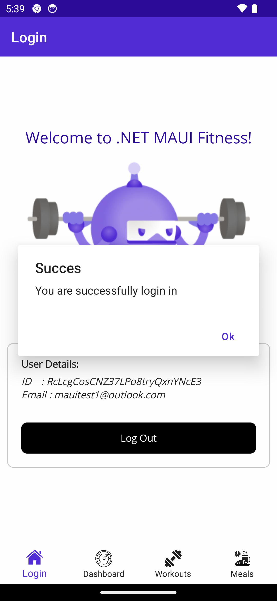
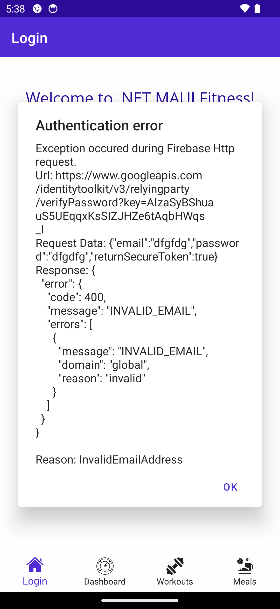
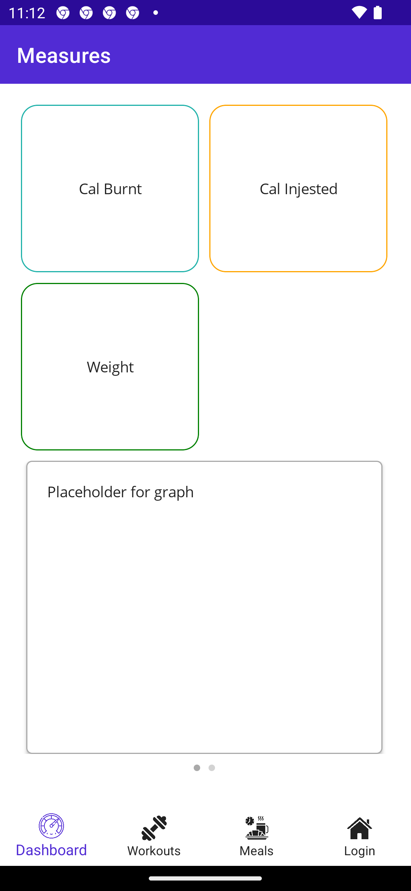
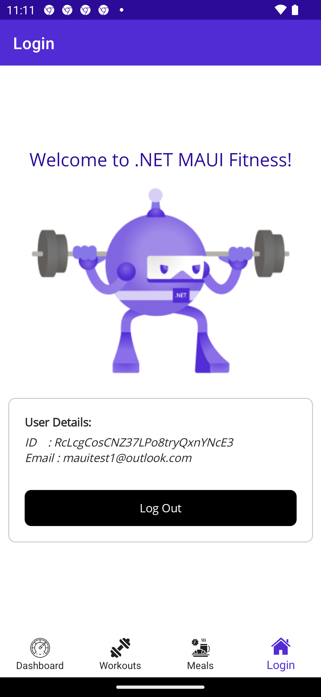

1. 📝 **Worth:** 3%  
2. 📅 **Due:** Friday April 12, 2024 @End of class
3. 🕑 **Late submissions:** Not accepted.
4. 📥 **Submission:** In class


## Objectives

In this lab, we will learn about authentication API to help you setup a similar mechanism in the final project. 

- Learn how to setup an authentication API
- Learn how to use it in a MAUI project
- Learn more about the `IConnectivity` interface
- Learn more about authentication and connectivity exception handling. 


## Authentication

Authentication is the process of validating the identity of a registered user or process before providing access to protected resources, networks or systems. It is a well studied problem in the domain of information security. Many protocols have been developed to standardize the process.

`OAuth` is an **open protocol** to allow **secure authorization** in a **simple** and **standard** method from web, mobile and desktop applications. It enables sharing data across APIs without having to share a password. As matter of fact, `OAuth` 2.0 is the industry protocol for authorization. It allows a user to grant limited access to its protected resources.

Many APIs use `OAuth` to provide authentication services to programmers to be able to build app with ease. Here are some of the common APIs that use OAuth:

- Firebase by Google.
- Azure Authentication by Microsoft.
- Auth0 (https://auth0.com/)

In this lab, we will examine `Firebase Authentication` and use it to authenticate users to use our `MauiFitness` app. Feel free to use any API in the project.

## Setup

- Use your section's GitHub classroom link:

  - [Section 1](https://classroom.github.com/a/t1cd9lYA)
  - [Section 2](https://classroom.github.com/a/7Ly8FIHk)

- Accept the assignment Clone this repo locally

- In the `MauiFitness` app, I have already added an `"appsettings.json"` file and included it as an embedded file

- I also added a `Settings` class to parse all the configuration strings into a static `Settings` class

- Use this class to add any new API key you will be using for this lab. Note: This is also how you should parse settings within your project.

  

#### Meals and workout Apis keys:

- Let's add API keys used by the `WorkoutService` and `MealService` class

- Create an https://api-ninjas.com/ account

- Go into MyAccount

- Click Show API Key

- Copy this API key 

- Add the following fields in `appsettings.json` and in the associated class `Config.Settings.cs`

  - `CaloriesApiKey: Your API key`
  - `CaloriesApiUrl`: `"https://api.api-ninjas.com/v1/nutrition?query="`
  - `ActivitiesApiKey: Your API key `
  - `ActivitiesApiUrl`: `"https://api.api-ninjas.com/v1/caloriesburned?activity="`


#### Firebase authentication Api key:

- Go to https://console.firebase.google.com/
- Login using a Google account (no need to create a new account)
- In the welcome page, click on `Create a project`
- Project Name: **MauiFitness** 
- Disable Google Analytics for this project, we will not use them.
- Click `Create Project`


- Setting Authentication
- Once the project is created, you will land in the main Firebase dashboard. 
- Scroll down and click on the `Authentication` block. 
- Click on `Get Started` to enable authentication and display the list of providers.
- Firebase Authentication provides backend services, easy-to-use SDKs, and ready-made UI libraries to authenticate users to your app. It supports authentication using passwords, phone numbers, popular federated identity providers like Google, Facebook and Twitter, and more. 
- In this lab, we will utilize it with a native provider via `Email/Password`. 
- Click `Email/Password` > `Enable` > `Save`
- The `MauiFitness` app does not include a registration functionality, so we will need to create user accounts manually.
- Go to the `Users` tab
- Add two users manually:
  - First user: an account for you (add your email and a password)
  - Second user: for the teacher to access your app
    - email: teacher@jac.ca
    - password: test@1234


> **Notes for the Project**  
>
> - As you may have noticed, Firebase provides options for the user to sign up with an email address or via an email link. You may use any of the options for the project. 
> - You may use other providers such as Google as well.
> - Feel free to use pre-built UI libraries for login and registration pages.

#### Adding the keys to `Settings` and `appsettings.json`

- Add the following values as public variables

  - `FirebaseAuthorizedDomain`

    - Get value from Firebase portal > Go to the `Settings` tab (while being in Authentication)
    - Under Authorized domains > copy the Firebase App domain (usually second entry)

    Example: `mauifitness-?????.firebaseapp.com`

  - `FirebaseApikey` 

    - Get value from Firebase portal > Left Navigation > Click on the gear icon ⚙️ next to `Project Overview` 
    - Select `Project Settings` > Under `General` tab > Web API Key

    

## Preparing App to use Firebase API

- Right-click on the solution and choose `Manage NuGet Packages`

  - Go to `Browse` tab > Search for `FirebaseAuthentication.net`.
  - Install latest version `4.1.0`. (Tested to be working with `MAUI` & `.NET 7.0`)

- In the existing `Services` folder

  - Create a class `AuthService` that will use the authentication we have setup on Firebase portal.

  - As discuss earlier, we will only use an `EmailProvider` for authentication. We need to create a client that accepts   an email provider. 

    - The code below is based on the NuGet package [documentation](https://github.com/step-up-labs/firebase-authentication-dotnet) sample code.
    - Check the sample code as it provides pre-built login webpage, which includes a registration link and possibility to login with any of the 3rd party providers.

    ```csharp
    public class AuthService
    {
        // Configure...
        private static FirebaseAuthConfig config = new FirebaseAuthConfig
        {
            ApiKey = App.Settings.FireBaseApiKey,
            AuthDomain = App.Settings.FireBaseAuthDomain,
            Providers = new FirebaseAuthProvider[]
            {
                    // Add and configure individual providers
                    new EmailProvider()
            },
        };
        // ...and create your FirebaseAuthClient
        public static FirebaseAuthClient Client { get; } = new FirebaseAuthClient(config);
        public static UserCredential UserCreds { get; set; }
    }
    ```

- Go to `LoginPage.xaml.cs` to update the login button click event to use Firebase authentication class.

  - Authentication process is an **IO bound call** and prone to errors.

    - Will fail if a wrong password or wrong username are provided.

    - Will fail is wrong API key is used and several other. 

    - Make sure to use a `try`-`catch` blocks.

      - Add multiple `catch` blocks each for specific exception type.
      - Start with more specific exception, then the general one.
      - Firebase exception type is `FirebaseAuthException` which has a `Reason` property which contains the reason of failure.
      - Log the `Reason` in the console
      - Display an alert with a description of the error.

      ```csharp
      try		
      {
          ...   
      }
      catch (FirebaseAuthException ex)
      {
          ...
      }
      catch (OtherExceptionType ex)
      {
          ...
      }
      catch (Exception ex)
      {
          ...
      }
      ```

      

    - Check if internet connectivity is available. Authentication will fail if there is no internet.

      - `.NET MAUI App` Connectivity [documentation](https://learn.microsoft.com/en-us/dotnet/maui/platform-integration/communication/networking?view=net-maui-7.0&tabs=android).

  - The `FirebaseAuthClient` (used in the `AuthService` class) provides different methods to assist in the login process:

    - `SignInWithEmailAndPasswordAsync(user_name.Text, password.Text)` attempt to login using the provided username and password.
    - Check the sample code on [GitHub](https://github.com/step-up-labs/firebase-authentication-dotnet).

  - Once authenticated make sure to save the returned `UserCredential` in the `UseCreds` property in the `AuthService` class. We need to use the authentication later to access the database.

    - Display an alert if the login was successful.
    - Display the exception message if an error occurred. 

    <div style="text-align:center;">
        
        
    </div>

- Test app while adding debug points to ensure that the authentication is done successfully.

## Change Login Page Behavior

Currently the login page is a tab and will not prevent the user from accessing the app. We need to change the behavior to have a landing page, which is the login page. Once logged in, we navigate to the app tabs.

- The app should have only two navigation routes: `Login` and `Home` (the app tabs). 
- Head to `AppShell.xaml` to make the changes:

```xaml
<Shell ...>
    <!-- Landing Page -->
    <ShellContent Route="Login" ContentTemplate="{DataTemplate views:LoginPage}" />

    <!-- App Tabs: note the use of FlyoutDisplayOptions="AsMultipleItems"  -->
    <TabBar Route="Index" FlyoutDisplayOptions="AsMultipleItems">
        <ShellContent Title="Workouts" ContentTemplate="{DataTemplate views:WorkoutsPage}" 
                      Icon="gym.png"/>
        <!-- Add the other tab pages .... -->
        
        <!-- Add the login page to be used to display account info and to logout-->
        <ShellContent Title="Account" ContentTemplate="{DataTemplate views:LoginPage}"
                      Icon="home.png"/>
    </TabBar>
</Shell>
```

- In the above setup, the `LoginPage.xaml` is used twice. We need to insure that only **a single instance** of it is created.
  - Go to `MauiProgram.cs` to register a singleton of the `LoginPage` and all the other pages since we only need a single instance of each. 
  - `.Net Maui` provides a built-in functionality to use `dependency injection` by either creating singleton or transient instance of a class. This functionality is similar to the one you used in `Asp .Net`. 
    - When object is created as a `Singleton`, the app will create a single instance of the object which will be remain for the lifetime of the application.
    - When object is created as a `Transient `, a new instance of the object will be created when requested during resolution. Transient objects do not have a pre-defined lifetime, but will typically follow the lifetime of their host.
  - The `builder` object has a `Services` property  that to register any object that is needed in app. 
    - Depending on the needs of your application, you may need to add services with different lifetimes, either singleton or transient. 
      - `AddSingleton<T>`
      - `AddTransient<T>`

```csharp
public static MauiApp CreateMauiApp()
{
    var builder = MauiApp.CreateBuilder();
    ...

    builder.Services.AddSingleton<LoginPage>();
    builder.Services.AddSingleton<WorkoutsPage>();
    builder.Services.AddSingleton<MealsPage>();
    builder.Services.AddSingleton<MeasuresPage>();

    return builder.Build();
}
```

> Check `.Net Maui` dependency injection [documentation](https://learn.microsoft.com/en-us/dotnet/architecture/maui/dependency-injection) for more details.

- On a successful login, navigate from the landing page, the login page, to the App.

  - Go to `LoginPage.xaml.cs` 

  - The App route is `Home`, add a navigation call once successfully logged in the button event handler.

    ```csharp
    await Shell.Current.GoToAsync($"//Index");
    ```

- App is ready for testing. 

  - Run the app. 
  - You should be presented with the login page (with no tabs at the bottom)
  - Enter the username and password, then click the login button.
  - If the login was successful, you should get an alert and would be redirected to the app with tabs.

<div style="text-align:center;">
    
    
</div>


## Logout Functionality

- The login page is used to provide the username and password. 

- It will be used to add a logout functionality as well. 

- Apply the following UI addition\modifications to the `LoginPage.xaml`:

  - Login Container: wrap the entries for the username and password, the login image button and error label with a container, such as `Frame`, `StackLayout` or a `Grid` and provide it with an `x:Name` value.
    - You might have already have it from milestone 1.
  - Logout Container: add another container below the above container that includes the following:
    - A label to display the user details.
    - A button to logout with a click event handler.
    - Assign an `x:Name` value to the container. 
    - Hide the container by using `IsVisible="false"`

- In `LoginPage.xaml.cs`

  - Modify the login button click event handler to do the following:

    - On a successful login:
      - Set the visibility of the login container to `false` to hide it.
      - Set the visibility of the out container to `true` to display it on the page.
        - Display the username and user ID (using `AuthService.UserCreds.User.Uid`)

<<<<<<< HEAD
    
=======
    
>>>>>>> 332306e16b57d6c7c1dfd6163c22f84af2dbce89

  - In the logout button click event handler:

    - Use the `Client` property to logout `AuthService.Client.SignOut()`
    - Clear the username and password entry fields.
    - Swap the containers visibility to show the login container and hide the logout container.
    - Finally, navigate to the login page using the route `await Shell.Current.GoToAsync($"//Login");`
    - Use `try`-`catch` blocks to catch any possible exception.

  - Test the login and logout functionality of the app.

    - Login using the created username and password.
    - Go to the last tab `Account`.
    - Click Logout. 
    - The app should navigate to the login page. (tabs will not be available after you logout)