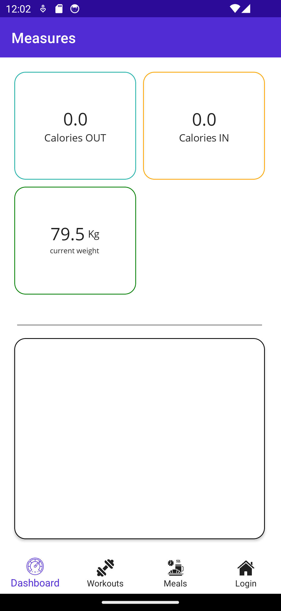
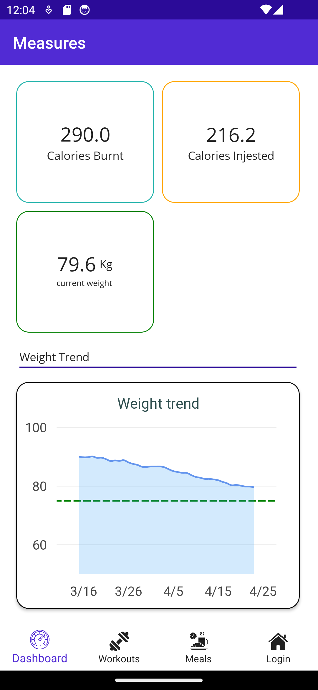
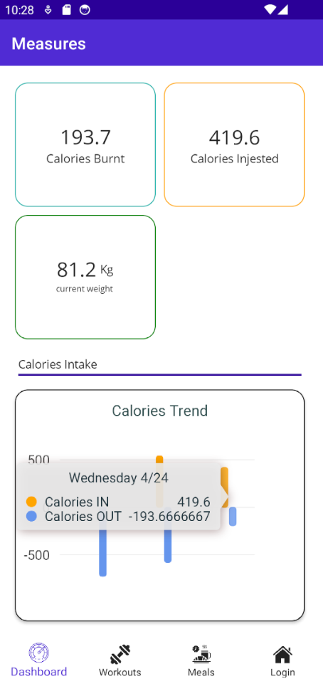

1. 📝 **Worth:** 2%  
2. 📅 **Due:** Friday April 26, 2024 @End of class
3. 🕑 **Late submissions:** 3 days maximum, 10% late penalty
4. 📥 **Submission:** In class @end of class.


## Objectives

The next requirement of this app is to implement the dashboard page to include a summary of the data and allow the user to view graphs. 


## Data Visualization 

Data Visualization is the representation of data using graphics such as charts, plots, animation, etc. It is a great way to increase the added value of your app to the user. You might be planning to add charts or other visualizations in your app. 

**How to choose the appropriate visual?**

**What** are you representing?

- Numeric: *temperature and humidity readings, calories, etc.*
- Categorical: *ON/OFF, True/False, Car Models, Brands, etc..*

**Why** are you representing this data?

- *The user needs to monitor temperature to make sure it isn't above the threshold*

**How** to present this information?

Examples:

- If you are interesting in monitoring a trend: user line charts
- If you are interesting in comparing two numbers or more, use bar charts or pie charts
- If you are interesting in comparing numbers in 2D or 3D: use maps or heatmaps. 
- If you are trying to represent many different attributes on the same chart, you can use the size, tilt and color of the markers as way to convey information.

**Dos and Dont's**	

- Keep it simple: We can create a tone of very cool visualizations but this can be overwhelming. Many people don't have a strong ability to decode visual elements which can just look very complex and hard to understand.
- Avoid using too many colors: Remember that a significant portion of people are color blind and they can't distinguish certain colors!
- Avoid redundancy: Don't encode the same information twice! 
- Try to group information as much as you can to avoid cluttering. 


## Setup

1. Accept and clone the Lab:

   - [Section 1](https://classroom.github.com/a/Wmu5iBUy)
   - [Section 2](https://classroom.github.com/a/p2ALDvo8)

2. Right-click on the solution and choose `Manage Nuget Packages`

3. Go to `Browse` tab 

4. Make sure to check `Include Prerelease`

5. Search for `LiveChartsCore.SkiaSharpView.Maui`

6. Install version `2.0.0-beta.701`

   - This is a free package and tested to be working with `MUI` and `.NET 7.0`
   - Has a clear [documentation](https://lvcharts.com/docs/maui/2.0.0-beta.700/gallery) with code examples in `C#` and `xaml`.
   - Make sure to consult the LiveCharts2 documentation to avoid confusion.
   - Main issues: 
     - there is no direct link between a collection of objects and chart data. This package uses custom classes called Series to populate the charts with data. You'll have to convert the data you want displayed into those special objects.
     - Every graph element such as custom x and y axes and titles need to be created in C#, so you have to restart the app very often in this lab to test each step.

7. Since this package is not part of the `MauiCommunityToolkit`, you have to add it to your app builder.

   In **MauiProgram.cs**:

   ```csharp
   var builder = MauiApp.CreateBuilder();
   builder
       .UseMauiApp<App>()
       .UseSkiaSharp() // add this line
       .ConfigureFonts(fonts =>
       {
           fonts.AddFont("OpenSans-Regular.ttf", "OpenSansRegular");
           fonts.AddFont("OpenSans-Semibold.ttf", "OpenSansSemibold");
       });
   ```

8. To help you sign in more quickly, modify the `LoginPage.xaml.cs` and hardcode the correct credentials in the `user_name.Text` and `password.Text` within the constructor of the page 

   ### Using `LiveCharts` package

1. Go to `MeasuresPage.xaml`

2. Add the namespace for `LiveCharts` within the `ContentPage` opening tag:

   ```xml
   
   xmlns:charts="clr-namespace:LiveChartsCore.SkiaSharpView.Maui;assembly=LiveChartsCore.SkiaSharpView.Maui"
   ```

3. Add two `CartesianChart`:

   ```xml
   <VerticalStackLayout VerticalOptions="Start">
       <charts:CartesianChart x:Name="Chart1" 
                              ZoomMode="ZoomX" HeightRequest="280"/>
       <charts:CartesianChart x:Name="Chart2"
                              IsVisible="false"
                              ZoomMode="PanX" HeightRequest="280"/>
   </VerticalStackLayout>
   ```

4. We need to provide this Chart with a list of `Series` entries as well as the custom `XAxes` and the `YAxes `and a graph `Title`. This can be achieved in the code behind of the page. However, it is better to keep the code clean by creating a class to get these attributes.

5. In the `DataRepos` folder, create a new static class called `ChartsRepo` to be used for that effect.

#### Modifying the `FitnessRepo` (0.5 pt)

- In the `FitnessRepo`, new properties `WeightHistory` and a `Goal`have been created to be used to create a weight chart showing a trend. 
- In addition,  you will add calculated properties to be used in the `MeasurePage` 
- Finally, to insure that the UI is notified when the `FitnessRepo` is changed and we need to insure that the calculated properties are updated when the Meals or Workouts collections are changed.

1. Add the following private method `AddTestData()` to help create test data for weights and call the method in the constructor:

   ```csharp
   private void AddTestData(int sample_points = 40)
   {
       WeightHistory = new List<Weight>();
       Weight weight;
       DateTime day;
   
       //First value is set to obesity level.
       WeightHistory.Add(
           new Weight(
               Weight.ObesityLimit,
               DateTime.Now.AddDays(-sample_points)
               ));
   
       Random random = new Random();
       for (int i = 1; i < sample_points; i++)
       {
           var delta = random.NextDouble() - 0.75;
           var value = WeightHistory[i-1].Value 
               + delta;
           day = DateTime.Now.AddDays(i - sample_points);
           weight = new Weight(value, day, Weight.WeightUnit.Kg);
   
   
           WeightHistory.Add(weight);
       }
       // setting the current weight and the goal
       CurrentWeight = WeightHistory[sample_points - 1];
       WeightGoal = new Weight(Weight.HealthyMax, DateTime.Now.AddDays(40));
   }
   
   ```

   

2. Add two more public properties which we will use in the `MeasurePage`:

   -  `CaloriesBurnt` : From the `Workout` items, calculates the sum of calories of all workouts of the day (Hint: use `DateTime.Today` to filter the workouts of interest)
   -  `CaloriesIngested` : From the `Meal` items, calculate the sum of calories of all meals of the day.

3. Modify the `FitnessRepo` so that it implements the `INotifyPropertyChanged` interface

4. Add a private method `OnPropertyChanged()` to help raise the `PropertyChanged` event:

   ```c#
   private void OnPropertyChanged(string propertyName)
   {
       PropertyChanged?.Invoke(this, new PropertyChangedEventArgs(propertyName));
   }
   ```

5. In the constructor, subscribe to the `CollectionChanged` event of the`MealsDb.Items` and raise the event that the `CaloriesIngested`: 

   

   ```csharp
   MealsDb.Items.CollectionChanged += (sender, e) => 
   {
   	//... raise the PropertyChanged event for the collection 
   }
   ```

   

6. Subscribe to the `CollectionChanged` event of the `WorkoutDb.Items` and raise the `PropertyChanged` event on the `CaloriesBurnt` property :

7. In the `MeasurePage.xaml` ensure to set the `BindingContext` of the page to the `App.Repo` which is now an observable object. 

8. Use data binding to set the calories IN and calories OUT Labels.

9. Use data binding to set the Weight and the weight measurement unit as show below:

   

12. Add some `Workout` items and `Meal` items with today's date and ensure that the calories count is updated.

#### Weight Chart (0.75 pt)

- The data `Series` populating this `Chart` will be composed of `DateTimePoint`s 
- `DateTimePoint` is a data point containing a `Time` attribute and a `Value`, this will make it easier for ourselves to display time in the x Axis of the graph.
- To build the graph, we will start by firstly creating the attributes that require more logic separately.
- Then we will instantiate one `CartersianChart` object and assign it all the created attributes. 
- Then, we can use this returned object in the code behind and bind it to the chart item. 

1. In the `ChartRepo`, create a public method `GetWeightChart()` which takes as input:

   - `List<Weight> weights` 
   - `Weight goal`

2. Start by converting the `weights` collection into `DateTimePoint`s

3. Create a `LineSeries<DateTimePoint>[]` containing one `LineSeries<DateTimePoint>`

   ```csharp
    LineSeries<DateTimePoint>[] series = {
            new LineSeries<DateTimePoint>
            {
                Name = "Weight",
                Value = //.. add conversion here
                
   ```

   - Set the following attributes:
     - `Stroke`: Sets the colors of the line chart, takes as `SolidColorPaint` as input 
     - `GeometrySize`: Controls the size of the markers, should be set to 0 as we do not want to have markers
     - `GeometryStroke`: Controls the border of the markers, set it to `null`
     - LineSmoothness`: controls the line curvature, set it to 0.95

9. Create a `Axis[]` for the **y axis** containing a `Axis` object 

   - Set the following properties:
     - `MinLimit`: 40
     - `MaxLimit`: 100

10. Create a `Axis[]` for the **x axis** containing a `DateTimeAxis` object, 

    - provide the following parameters to the constructor:

      - `unit`:  controls the unit of the axis (hours, days, months), set it to`TimeSpan.FromDays(1)`

      - `formatter`:  a label formatter which transforms the date to a label

        ```c#
        date => $"{....}" // to be completed
        ```

    - Format the date elements so that the values appear as MM-dd 

11. Let's create a `LabelVisual` object to use as a **Title** for the chart. 

- Set the following properties:

  - `Text` : "Weight Trend"

  - `TextSize`: 18

  - `Padding`: `new LiveChartsCore.Drawing.Padding(15)`

  - `Paint` : `new SolidColorPaint(SKColors.DarkSlateGray)`

12. Add a `Section` which is a visual element added to the graph to highlight a particular part. Let's add a green dashed line to show where the weight goal is:

```csharp
RectangularSection[] sections =
{
    new RectangularSection
    {
        Yi = goal.Value,
        Yj = goal.Value,
        Label = "TargetWeight",
        Stroke = new SolidColorPaint
        {
            Color = SKColors.Green,
            StrokeThickness = 2,
            PathEffect = new DashEffect(new float[] { 6, 6 })
        }
    }
};
```

13. Create a new `CartesianChart` object and set its properties:

    - `Series`: to the `LineSeries<DateTimePoint>[]` created earlier

    - `YAxes`: to the `Axis[]` created earlier 

    - `XAxes`: to the `Axis[]` created earlier 

    - `Section`: to the `Section` created earlier

    - `Title`: to the `LabelVisual` created earlier.

**Testing**

14. Modify the `MeasurePage.xaml.cs` code behind to call the `GetWeightChart()` use the `App.Repo.WeightHistory` and `App.Repo.WeightGoal` 

15. Set the returned chart to the `Chart1.BindingContext` within the constructor of the page:

    ```csharp
    Chart1.BindingContext = ChartsRepo.GetWeightChart(App.Repo.WeightHistory,
                                        App.Repo.WeightGoal);
    ```

16. Modify the `MeasurePage.xaml` to bind all the attributes of the chart:

```xml
<charts:CartesianChart x:Name="Chart1" 
                       Series="{Binding Series}" 
                       XAxes="{Binding XAxes}" 
                       YAxes="{Binding YAxes}"
                       Title="{Binding Title}" 
                       Sections="{Binding Sections}"
                       ZoomMode="ZoomX"/>
```



#### Calories Chart (0.75 pt)

- The idea behind this chart is to be able to visually compare the calories intake to the calories burnt on a daily basis and see the progress overtime. 
- The information will be conveyed in a bar chart and to make a distinction between calories burnt and calories ingested we will use two different colors orange and blue. Feel free to select other colors.

1. Create a public method`GetCaloriesChart()` which takes a input:

   - `ObservableCollection<Meal> meals` 

   - `ObservableCollection<Workout> workout `

   -  returns a `CartesianChart`

2. First, start by converting the Meals collection into an array of `DateTimePoint`s where each point represents the total calories ingested during a day. 

> Hint: Use `GroupBy()` to group Meals by day, then use a `Select()` on each group and return a `DateTimePoint` with the associated day and calories `Sum()`.

3. Repeat the same process for the Workouts collection but use the negative sum of the calories per day. 

4. Create a `ISeries[]` list containing two `ColumnSeries<DateTimePoint>()`:

   ```csharp
   ISeries[] series =
   {
       new ColumnSeries<DateTimePoint>()
       {
           Name="Calories IN",
           Values = caloriesInPerDay,
           //..to be completed...
   
       },
       new ColumnSeries<DateTimePoint>()
   	{
           Name="Calories OUT",
           Values = caloriesOutPerDay,
       }
   }
       
   ```

   For each `ColumnSeries` set the:

   - `Stroke` : takes a `SolidColorPaint`
   - `Fill`: takes a `SolidColorPaint` 
   - `MaxBarWidth`:  10
   - Set the meals series color to `SKColors.Orange` 
   - Set the workouts series color to `SKColors.CornflowerBlue` and the meals color to `SKColors.Orange`

5. Create a `Axis[]` for the **y axis** containing one `Axis` object 

6. Set the following properties:

   - `MinLimit`: - 800

   - `MaxLimit`: +800

   - `MinStep`: 500

   - `ForceStepToMin`: true

     

7. Create a `Axis[]` for the **x axis** containing one `DateTimeAxis` object, provide the following values to its constructor

   - `unit`:`TimeSpan.FromDays(1)`

   - `formatter`: 

     ```c#
     date => $"{....}" // to be completed
     ```

   Format the date elements so that the values appear as *"Friday 04-26"*

8. Create a `LabelVisual` object to use as a Title for the chart. Set the following properties:

   - `Text` : "Calories Trend"
   - `TextSize`: 18
   - `Padding`: `new LiveChartsCore.Drawing.Padding(15)`
   - `Paint` : `new SolidColorPaint(SKColors.DarkSlateGray)`

9. Create and return a new `CartesianChart` while setting its properties:

   - `Series`: to the `ISeries[]` created earlier
   - `YAxes`: to the `Axis[]` created earlier 
   - `XAxes`: to the `Axis[]` created earlier 
   - `Title`: to the `LabelVisual` created earlier.

   **Testing**

10. Make sure to add enough valid `Meals` and `Workout` to your database.

11. Modify the `MeasurePage.xaml.cs` code behind to call the `GetCaloriesChart()` 

12. Set the returned chart to the `Chart1.BindingContext` within the constructor of the page:

    ```csharp
    Chart2.BindingContext = ChartsRepo.GetCaloriesChart(App.Repo.MealsDb.Items,
                                                        App.Repo.WorkOutDB.Items);
    ```

13. Modify the `MeasurePage.xaml` to bind all the attributes of the chart:

    ```xml
    <charts:CartesianChart x:Name="Chart2" 
                           Series="{Binding Series}" XAxes="{Binding XAxes}" 
                           YAxes="{Binding YAxes}"
                           Title="{Binding Title}" IsVisible="false"
                           ZoomMode="PanX" HeightRequest="280"/>
    ```

    

14. Add an event handler to the `Picker` in which you should make visible the chart selected by the user.

    

    


15. You'll notice that the charts do not update if the data is modified. To ensure that the charts are reevaluated override the `OnAppearing` method to set the Charts binding context here: 

    ```csharp
    protected override void OnAppearing()
    {
    
        Chart1.BindingContext = ChartsRepo.GetWeightChart(App.Repo.WeightHistory,
                                            App.Repo.WeightGoal);
    
        Chart2.BindingContext = ChartsRepo.GetCaloriesChart(App.Repo.MealsDb.Items,
                                                            App.Repo.WorkOutDB.Items);
        Chart1.IsVisible = true;
        Chart2.IsVisible = false;
    
    }
    ```

    **✨ Test your understanding**: How can you ensure that the charts are updated in real time as you are receiving real time data?


