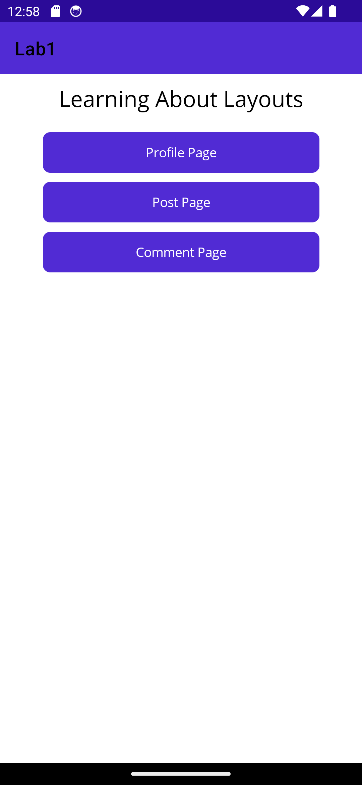
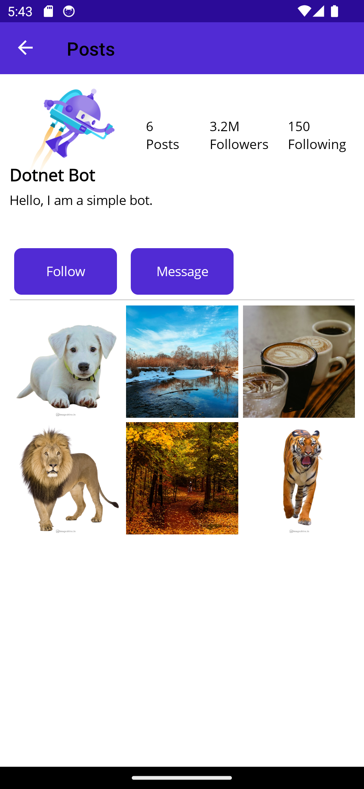
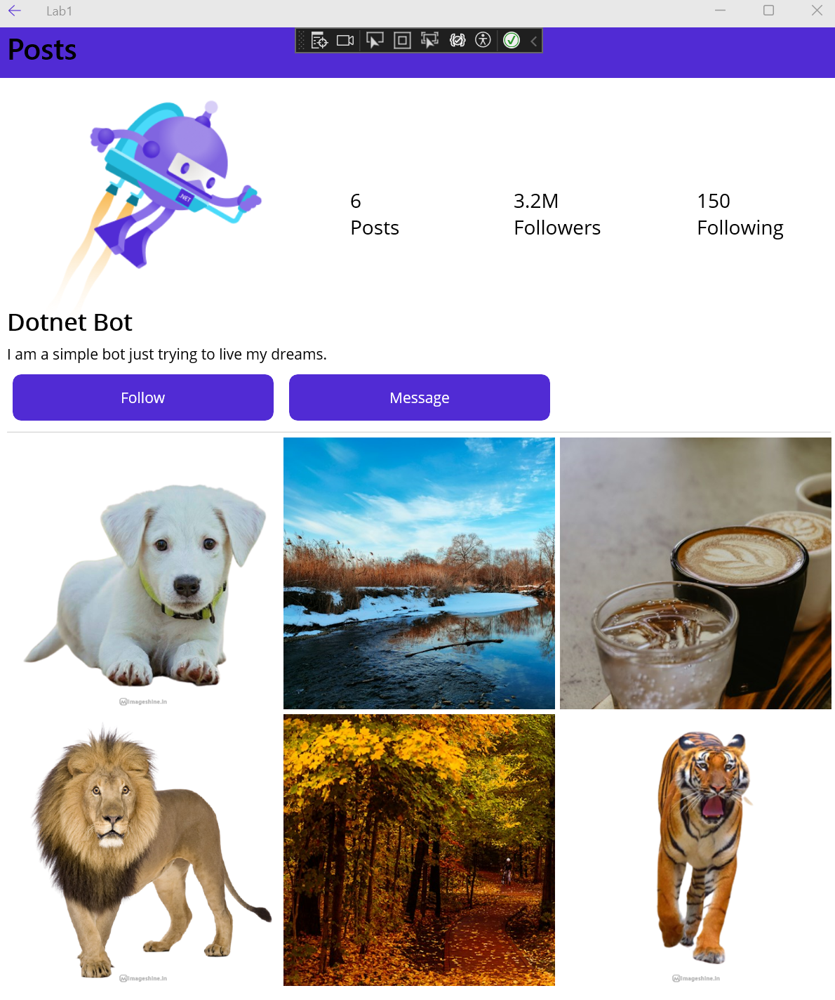
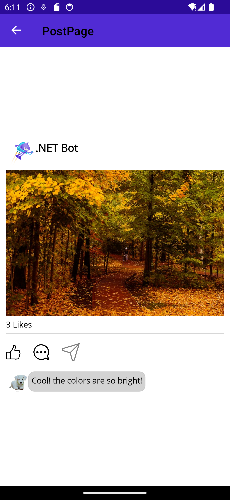
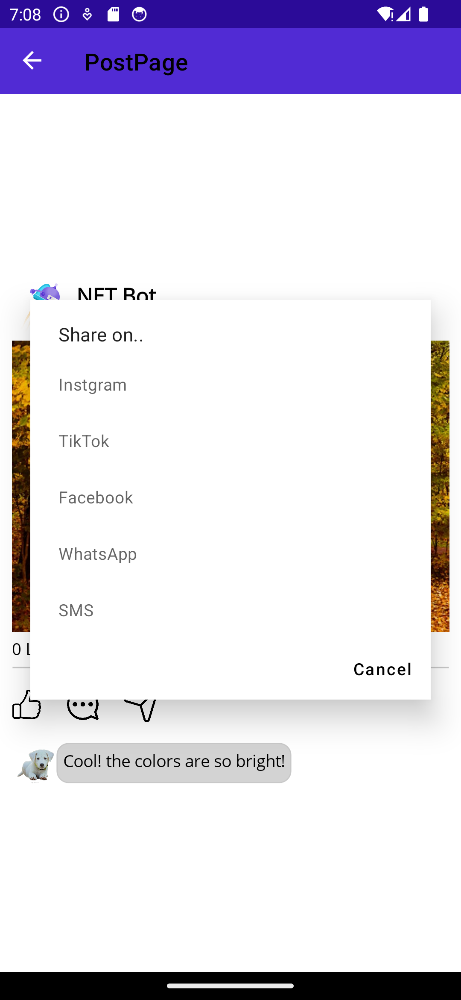
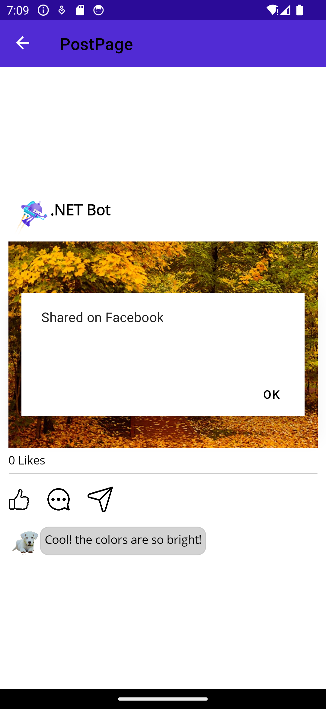
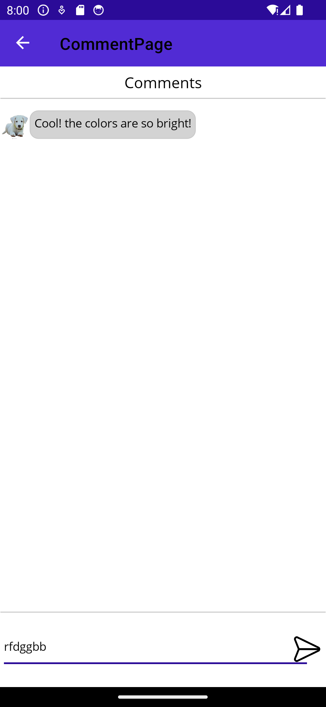
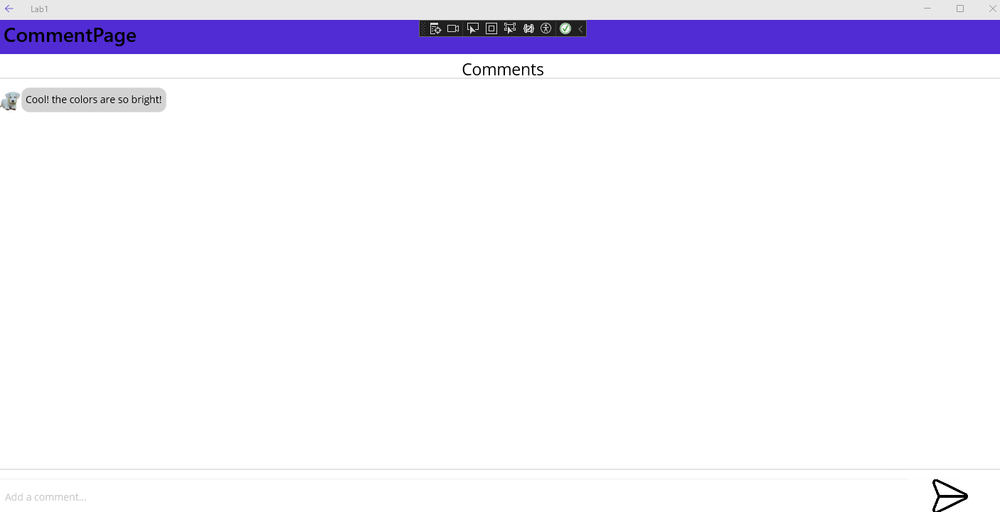

This lab will help you get familiar with the various MAUI layouts and controls. 

- 📝 **Worth:** 2%
- 📅 **Due:** Friday Feb 9, 2023 @End of class
- 🕑 **Late submissions:** 3 days maximum. 10% penalty per day.
- 📥 **Submission:** In class 


## Objectives

- Create the UI skeleton for a social media app
- Use a Grid Layout
- Use a Vertical and Horizontal Stack Layout
- Use the Absolute Layout


## Create a MAUI Project

- Create a .NET MAUI Project
- Name: **Lab1**
- .NET: **7**

#### Target platform

For this lab we will be testing the app on two different form factors:

- Android Emulator: Pixel 5 - API 34
- Windows Machine

## Modify the Main Page

- Modify the main page to include:

  - A `Label`: `Text`=`"Learning About Layouts"`, `FontSize`=`"Title"`. Make sure the Label is centered horizontally.
  - A `button`: `Text`=`"Profile Page"`, `Clicked` (create a new event handler)
  - A `button`: `Text`=`"Post Page"`, `Clicked` (create a new event handler)
  - A `button`: `Text`=`"Comment Page"`, `Clicked` (create a new event handler)

  

  

  

- Rename your event handlers so that they follow the standard ***Btn_ButtonName_Clicked***


#### App Navigation

- The app consists of three main pages:
  - Profile Page
  - Post Page
  - Comment Page

- We will use the basic stack navigation we have used so far in this course


> Create a folder called Views. Add newly created pages in this folder.


## Modify the Profile Page

- Download the following [sample](../files/Lab1_sample_images.zip) images and place them into your  `Resources > Images` folder

- Modify the default `ProfilePage.xaml` to include the following:

  - Remove the default `VerticalStackLayout` and replace it with a `Grid`
  - The `Grid` must have the following specs:
    - Have as parent the `ScrollView`
    - Columns: 3 adaptable to the screen size
    - Rows : 3 adaptable to the screen size
    - The first row must have a height that is 2 x bigger than all the other rows.
    - `Padding`: 10
    - `RowSpacing`: 5
    - `ColumnSpacing`: 5

- Add the following items to the following positions (Row,Column):

  - (0,0)`Image`:
    - `Source` = "dotnet_bot_jetpack.png"
    - `MaximumHeightRequest`="300"
  - (0,0)`Label`:
    - `Text` = "Dotnet Bot"
    - `FontSize`="Medium"
    -  `FontAttributes`="Bold"
    - `VerticalTextAlignment`="End"
  - (0,1) `Grid`: 
    - 3 columns x 1 row with three labels
      - (0,0): "6 Posts"
      - (0,1): "3.2M Followers"
      - (0,2): "150 Following"
      - Hint: Use  `&#10;` to end a line.
  - (1,0)`Label`
    - `Text`="I am a simple bot trying to live my dreams."
    - `Grid.ColumnSpan`=3
  - (2,0)`Button`:
    - `Text`="Follow"
    - `MaximumHeightRequest`="60"
  - (2,1)`Button :`
    - `Text`="Message"
    - `MaximumHeightRequest`="60"
  - (3,0) `Border`
    - `Grid.ColumnSpan`="3"
    - `Stroke`="LightGray" 
    - `MaximumHeightRequest`="1"
  - (4,0) to (5,1) `Image`
    - `Source` : use the sample images to populate the mosaic
    - `Aspect`="AspectFill"

  

  

  
  
  This is what your layout should look like
  
  

<div>




## Modify the Post Page

The post page contains all the details of a social media post. To keep it simple, we will only display 1 post and 1 comment:




This page should be composed of a main `VerticalStackLayout` centered on its parent and separating each child by 5 pixels. It will contain the following information:

- Information about the owner
- Post image
- Number of likes
- Like, Comment and share buttons
- Comments section

#### Post Owner

The header of the post contains the information about the owner of the post. It is made up of a simple `HorizontalStackLayout` containing the following elements:

- `Image`: 
  - `Source` = "dotnet_bot_jetpack.png"
  - `WidthRequest`=50
- `Label`:
  - `Text` = "DotNet Bot"
  - `FontSize`="Medium"
  - `FontAttribute`="Bold"


#### Post Content: Image and likes

This area is where the image should be added in the main `VerticalStackLayout`:

- `Image`:
  - `Source`="fall.png" (or any other sample photos)
  - `Aspect`="AspectFill"
- `Label`:
  - `x:Name`="LikesLabel"
  - `Text`="0 like"
- `Border`:
  - `BackgroundColor` = "LightGray"
  - `HeightRequest`="2"


#### Like, Comment and Share:

This area is made up of another `HorizontalStackLayout` containing three `ImageButton`, which is an image that is clickable and can be linked to an event handler similar to a Button.

- `ImageButton`:

  - `Source `= "like.png" 

  - `WidthRequest`="25"

    [^1]:  <a href="https://www.flaticon.com/free-icons/like" title="like icons">Like icons created by Freepik - Flaticon</a>

    

  - `Clicked`="Btn_Like_Clicked" (add a new event handler)

- `ImageButton`:

  - `Source`= "comment.png"

  - `WidthRequest`="30"

    [^2]: <a href="https://www.flaticon.com/free-icons/comment" title="comment icons">Comment icons created by onlyhasbi - Flaticon</a>

    

  - `Clicked`: "Btn_Comment_Clicked" (add a new event handler)

- `ImageButton`:

  - `Source` ="share"

  - `WidthRequest`="30"

    [^3]: <a href="https://www.flaticon.com/free-icons/share" title="share icons">Share icons created by Aldo Cervantes - Flaticon</a>

    

  - `IsEnabled`="False"

  - `Clicked`: "Btn_Share_Clicked" (add a new event handler)

#### Like Event Handler

- In the code behind, add a counter for the number of likes and make sure the likes label is updated every time the like button is clicked:


```csharp
int likesCount = 0;
///...
private void Btn_LikeButton_Clicked(object sender, EventArgs e)
{
    ///...
}
```

 

#### Share Event Handler

- Modify the signature of the event handler to make it run asynchronously:

```csharp
private async void Btn_ShareButton_Clicked(object sender, EventArgs e)
{
   ///\TODO...
}
```


- Show a `DisplayActionSheet` to allow the user to select the platform then show `DisplayAlert` to confirm that the post was shared on the selected platform. Read more about [MAUI Pop-ups](https://learn.microsoft.com/en-us/dotnet/maui/user-interface/pop-ups?view=net-maui-7.0)

> Hint: Use the `await` keyword to save the returned user selection in a `string` variable.
>

<div>
    
    
</div>


#### Comment Event Handler

For simplicity:

- push a `CommentPage` on the stack (similar to the `MainPage` Comment Page Button)

#### Comment section:

The comment section should contain a single `HorizontalStackLayout` with the following children:

- `Image`:

  - `Source`="dog.png"

- `Border`:

  - `BackgroundColor`="LightGray"

  - `StrokeShape`="RoundRectangle 10,10,10,10"

  - `Padding`="5"

  - Child:

    - `Label`:
      - `Text`="Cool! the colors are so bright!"
      - `FontSize`="Medium" 

    

## Modify the Comment Page

This page is composed of a title section at the top of the screen, a large middle section where the comments will appear and finally a text entry at the bottom part of the screen. This page should be composed of an `AbsoluteLayout`containing the following items with the given bounds: 

- `Label` 

  - x= 50%
  - y= 1%
  - Width = 200 pixels
  - Height = 100 pixels
  - `Text`="Comments"
  - `FontSize`="Medium"
  - `HorizontalTextAlignment`="Center"

- `Border`

  - x= 50%
  - y= 5%
  - Width = 1 pixel
  - Height = 2 pixels
  -  `BackgroundColor`="Gray" 

- `VerticalStackLayout`

  - x= 50%
  - y= 35%
  - Width = 100%
  - Height = 80%
  - child :
    - `HorizontalStackLayout`

- `Border`

  - x= 50%
  - y= 88%
  - Width = 1 pixel
  - Height = 2 pixels
  -  `BackgroundColor`="Gray" 

- `Entry`

  - x = 2%
  - y = 97%
  - Width = 95%
  - Height = 50 pixels
  - `Placeholder`="Add a comment..." 

- `ImageButton`

  - x= 98%
  - y= 97%
  - Width = 8%
  - Height = 50
  - `Source`="send.png"

  

The Comment Page should have the following appearance. Note: I am not expecting the Send button to be connected to an event handler.

<div>
    
    
</div>


**End of the lab!**


### Grading Rubric

| Exercise                                   | Expected Results                                             | Points |
| ------------------------------------------ | ------------------------------------------------------------ | ------ |
| Profile Page - Grid definition             | Use of a Grid Layout                                         | 0.25   |
| Profile Page - Element position            | Correct positioning of the items on the grid                 | 0.25   |
| Post Page - Vertical and Horizontal Stacks | Use of a VerticalStackLayout and three HorizontalStackLayouts | 0.25   |
| Post Page - Like Button                    | Implementation of a likes counter in the code behind         | 0.25   |
| Post Page - Share Button                   | Use of DisplayActionSheet and DisplayAction                  | 0.5    |
| Post Page- Comment Button                  | CommentPage is pushed on the stack when the comment button is clicked | 0.25   |
| Comment Page - Element position and sizing | Correct positioning and sizing flags                         | 0.25   |

