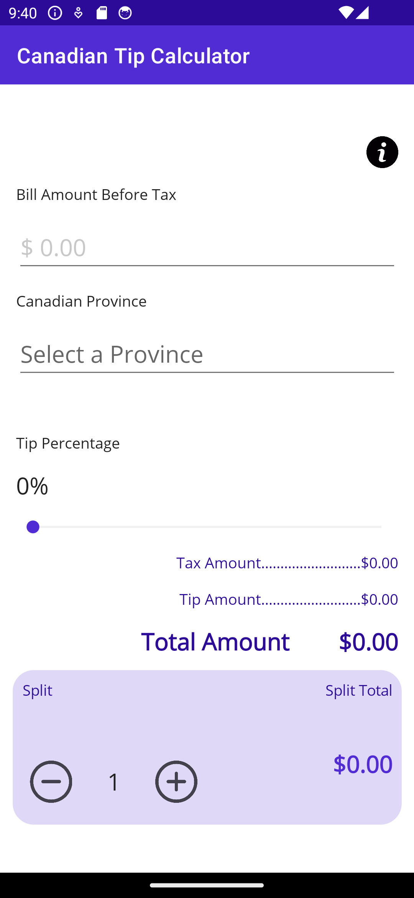
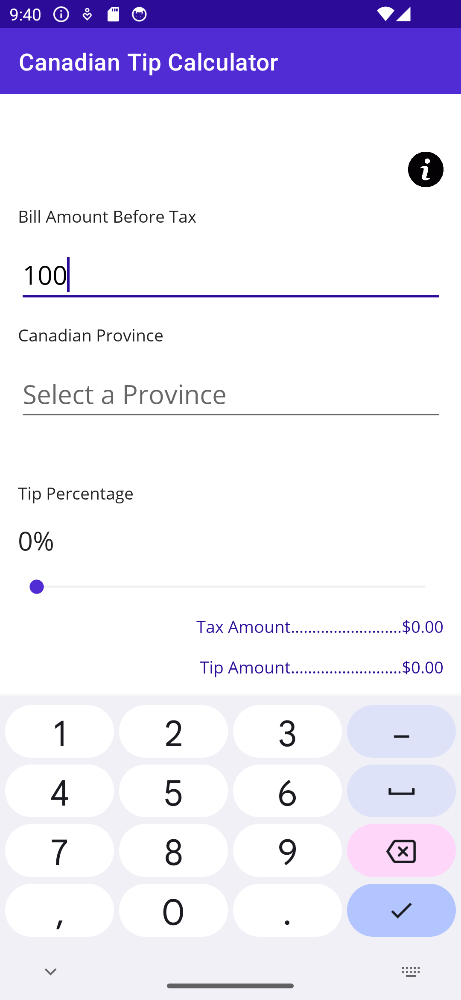

This lab will help you refresh your knowledge of XAML data binding and get familiar a little bit closer to having a proper app architecture.

* **Worth**: 3%
* 📅 **Due**: February 23, 2024 @11:59PM
* 🕑 **Late Submissions**: Deductions for late submissions is 10%/day. 
  *To a maximum of 3 days. A a grade of 0% will be given after 3 days.*
* 📥**Submission**: Demo of the UI in class + code submission through GitHub classroom.

## Objective

- Use XAML Binding 
- Use View to Code Behind Binding
- Learn how to separate the business logic from the Views
- Build a simple tip calculator app for Canadians.

## Project Preparation

- Check the `GitHub` classroom link shared with you on Teams and accept the assignment.
- Once your private repo is created, clone it to your computer.
- Create a new `.NET MAUI App` project in the cloned folder using the following specifications:
  - Project Name: `TipCalculator`
  - ⚠️ Target Framework: **.NET 7.0**

#### Target platform

For this lab we will be testing the app on two different form factors:

- Android Emulator: Pixel 5 - API 34 (if available)
- Windows Machine

## User Interface

Modify the `MainPage.xaml` to create a simple tip calculator. **You may use the following design** or a design of your choice:

## UI - Requirements

- Download the button icons from [here](../images/labs_images/Lab2/icons.zip), you are free to use other icons if you prefer.

- **Information button: `ImageButton`** 

  - `Source`=`"info.png"` or you may use the icon of your choice.
  - `MaximumHeightRequest`=30
  - `MaximumWidthRequest`=30
  - Add an event handler and rename it accordingly.
  - On click the app navigate to the "Canadian Tip Info" page. (Text will be provided at the end of the assignment)

- **Bill Amount Before Tax: `Entry`.**

  - `PlaceholderText`: $0.00

  - `TextChanged`: Create an event handler and name it accordingly

  - `FontSize`: `Large`

  - Allow numeric values only:

      

- **Tip Percentage: `Slider`.**

  - Define the  `x:Name` to be able to reference it elsewhere.

  - Tip minimum value is 0% and max value is 100%.

  - Label for tip value must be updated using `XAML`(not in the associated `C#` code.

  - The displayed tip value should increase by 1. **No decimal should be displayed.**

    

    

- **Canadian Province: `Picker`** 

  -  Define the `x:Name` to be able to reference it elsewhere.

  -  The picker will use a class model to display the Canadian provinces. 
    (`Province` class details are provided in the next section).

  -  Note I suggest you complete the picker after finishing your models and static classes.

  -  Picker may be populated using its `ItemsSource` property.
    - An easier way is to add all provinces using an array in the similar manner done in a `CollectionView` in `XAML` in the example seen in class.
    - You can then use the `ItemDisplayBinding` to set the attribute to display of each item contained in the List

    

- **Tax Rate `Label`**: 

  - Right below the picker a `Label` will display the HST\GST Tax for the selected province in the picker using the province object.
  - You must only use `XAML` binding not the code behind.

- **Tip Amount `Label`** 

  - `Label` displaying calculated the tip amount.
  - `Tip Amount = (Tip Percent) /100 x Bill Amount before Tax`

- **Total Amount `Label`**:

  -  displaying total bill amount including provincial tax and tip.
  - `Tax Amount = (Provincial Tax) /100 x Bill Amount before Tax`
  - `Total Amount = Bill Amount before Tax + Tax Amount + Tip Amount`

- **Split Options:**

  - Allows user to split the total amount based on a split value (number of people sharing the bill).
  - Allows user to see how many people are splitting the bill and increase/decrease this value
  - **Note: the number of people splitting the bill will always be greater or equal to 1*** 

  #### **Tip Info Page**

  - Information about tipping.

  - *Note: the content of the text is bigger than the screen.* 

  - Use proper text styling and formatting, do not dump text into UI: Grades will be deduced for bad UI design:

    

#### Information Text

> ***At the restaurant (waiter or waitress)***
>
> *The standard tip at a restaurant is 15% and may exceed 20% (which is a very good tip).However, when you talk about tip for take-out orders, it is often zero.*
> 
> ***Restaurant Delivery Person***
> 
> *The standard for restaurant delivery is usually 10% of the amount before taxes.*
> 
> ***Hotel***
> 
> *The maids are generally entitled to $1 overnight stay / room. It is the same amount per luggage for a Porter.*
> 
> ***Dressing or hairdresser***
> 
> *The amount of tip for hairdressers or barbers is between 5% and 15%.*
>
> ***Taxi Driver***
>
> *The amount reserved for taxi drivers varied from 10% to 15% depending on the service offered. If the driver helps you with your luggage or guide you to different places to visit, the percentage should be considered on the rise. ($ 1 / bag and / or 15% of the stroke)*
>
> ### Tips in Other Countries
>
> ***United States***
>
> *The tip standards are essentially the same as in Canada.*
>
> ***Mexico, Cuba, Dominican Republic***
>
> *The tip is usually between 5% - 15%.*
>
> ***Brazil, Columbia, Chile, Ecuador***
>
> *The tip is usually included in the price of the invoice. However, it is very appreciated, especially when good service to give an amount up to the difference in the rounded invoice or around 5%.*
>
> ***Iceland and Finland***
>
> *No need to pay tips*
>
> ***China, Japan, South Korea***
>
> *The tip is not necessary and can even insult the person who rendered the service.*
>
> ***Other countries***
>
> *A 10% tip is never wrong. However, you can go from 5% to 10%.*

[1]: https://hellosafe.ca/en/travel-insurance/tipping-world-map	"Source: Hello Safe Map"

## Models

Organize your project by creating a `Models` folder. Add the following new classes:

- `Province` class: represents each province basic information. In this app you require:
  - the province's name : `string`
  - the province's HST\GST Tax : `decimal`
- `Bill` class: this class should include all the information related to the bill and the total amount calculation:
  - Extract the **concepts** from the app design above, for example: Total amount, amount before taxes, tax amount, tip amount, number of people splitting the bill, etc.
  - Respect the OOP Pillars:
    - **OOP Encapsulation:** avoid exposing unnecessary information in the `Bill` class and hide **all calculations**. 
    - **OOP Abstraction:** all variables related to the `Bill` class should be defined in the class.  Avoid adding these variables in the code behind of the `XAML` page. The code behind should only define an object of the `Bill` class and use its members.
    - **Validation**: You model is not aware of the View and therefore should validate that the value provided to the setters. 

> Hint: use calculated properties for the Tax Amount, Tip Amount, Total Amount and the Split Amount.
>
> Note: The classes should be built without having any dependency on the technology used. (on `MAUI` or `XAML`)

## Data Repos

Organize the data you use inside your project by creating a `DataRepos` folder. Add the following new static classes:

- `Provinces`: Contains a single public attribute which is an iterable (array, list, etc..) of all the Canadian provinces and their respective tax rates: 

  | Province                  | Tax Rate |
  | ------------------------- | -------- |
  | Alberta                   | 5%       |
  | British Columbia          | 12%      |
  | Manitoba                  | 12%      |
  | New Brunswick             | 15%      |
  | Newfoundland and Labrador | 15%      |
  | Northwest Territories     | 5%       |
  | Nova Scotia               | 15%      |
  | Nunavut                   | 5%       |
  | Ontario                   | 13%      |
  | Prince Edward Island      | 15%      |
  | Quebec                    | 14.975%  |
  | Saskatchewan              | 11%      |
  | Yukon                     | 5%       |

## Binding the View with the Model and Repos

- Once the classes are built integrate them to the View. Create an object `Bill` in the code behind (or in `XAML`) and use binding to connect its various properties to the code behind.  
- As for the data repo, simply include its namespace in the code behind and refer to the `Provinces` array, it's static object!
- I suggest you add breakpoints inside the model's properties setters and validate that they get executed when certain UI elements are modified. 
- If you see some properties not being updated on the screen that is most likely because values are changing without notifying the view:
  - Remember there is many ways of implementing this app. You can use the `INotifyPropertyChanged` interface, or simply call an Update method every time a value has changed. It's up to you to decide. 
  - I will be posting various possible solutions for this Lab. 
- If you find yourself writing logic code in the code behind (example calculating a value), you know that you have missed to add that functionality in the class.

## Functionality 

Note that the app design does not include any "Submit" button to invoke the calculation of tip or total amount. Use event base programming with the combination of data binding to have the app automatically update the UI labels.

## Grading Rubric

| Evaluation Criteria  | Details                                                      | Worth |
| -------------------- | ------------------------------------------------------------ | ----- |
| **Functionality**    | App does everything and works as expected. App does not crash. | 2     |
| **UI Design**        | All requested elements available. Use of at least 2 nested layouts. Use of application resources for UI styling.  | 3     |
| **Data Binding**     | Use of View-to-View binding when possible.  Use of View-to-Code-Behind binding over event handlers. | 4     |
| **Model Classes**    | Proper class design and use of OOP pillars. `Province` class (5)  `Bill` class (15) | 2     |
| **App Architecture** | Separation of the logic and the presentation layers of the app *There should be no calculations done in the code behind.* | 2     |
| **Name & ID**        | At the top of all submitted files: provide your name, student ID and assignment number. | 1     |

# References

1. Web agency telorDesign, Calculators and conversion tools:  https://www.calculconversion.com/tip-calculator-canada.html, last accessed on Feb 11 2024

2. Retail Council of Canada, Sales Tax Rates by Province: https://www.retailcouncil.org/resources/quick-facts/sales-tax-rates-by-province/, last accessed on Feb11 2024

3. Hellosafe, [Map] In which countries of the world is it common to tip and how much? :https://hellosafe.ca/en/travel-insurance/tipping-world-map, last accessed on Feb 13