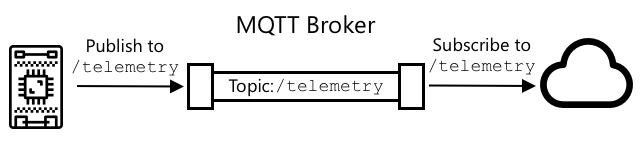
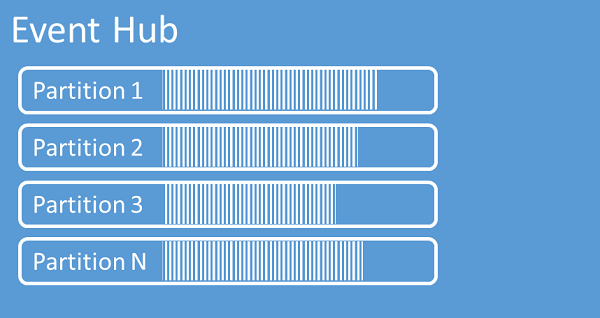

# IoT Hub to .NET MAUI App

## Fixed Values per container

This is a exhaustive list of all fixed string values used for the project, refer to the Setup section below to configure the IoT Hub and gather all these strings from the Azure portal. 

- `ConnectionConfig`
  - `StorageConnectionString`
  - `BlobContainerName`
  - `ConsumerGroup`
  - `EventHubConnectionString`
  - `EvenHubName`
  - `DeviceId`


## Key concepts

From the Connected Objects course:

- **IoT Communication protocol - Publisher-Subscriber:**

  - There is a `MQTT` broker allowing a Publisher-Subscriber connection with the IoT hub and the client used in the .NET App.

    

  - MQTT (Message Queueing Telemetry Transport) is a lightweight sub/pub protocol which manages messages **asynchronously** over a **network** socket. 

  - We won't be constantly looping as with with HTTP's request-repone style of communication.

  - Since both ends act as publishers and subscribers, we call both ends **"clients"**

    

- **Telemetry**: Data published by the client and received by another client. 

- **Event Hub client**:

  - Primary interface for developers interacting with the Event Hubs client library. There are different kinds of event Hub clients, each dedicated to a specific use of the event Hubs, such as publishing or consuming events.

- **Event Hub producer:**

  - Type of client that serves as a source of telemetry data, diagnostics information, usage logs, or other log data, as part of an embedded device solution, a mobile device application, a game title running on a console or other device, some vlient or server basd solution, or a web site.

- **Event Hub consumer**:

  - Type of client which reads information from the Event hub and allows processing of it. Processing may involve aggregation, complex computation, filtering, distribution of the data or storage of the information in a raw or transformed fashion.

- **Partition: ** 

  - Ordered sequence of events that is held in an Event Hub

  - Partitions are a means of data organization associated with the parallelism required by event consumers. 

  -  Azure Event Hubs provides message streaming through a partitioned consumer pattern in which each consumer only reads a specific subset, or partition, of the message stream.

    

  - As newer events arrive, they are added to the end of this sequence. The number of partitions is specified at the time an Event Hub is created and cannot be changed.

    

- **Consumer group**

  - is a view of an entire Event Hub
  - Consumer groups enable multiple consuming applications to each have a separate view of the event stream
  - and to read the stream independently at their own pace and from their own position.
  - There can be at most 5 concurrent readers on a partition per consumer group; however it is recommended that there is only one active consumer 

- **Device Twin:** 
  - *Contains device metadata from your solution back end.*
  - *Reports current state information such as available capabilities and conditions.*
  - *Synchronizes the state of long-running workflows, such as firmware and configuration updates, between a device app and a back-end app.*
- **D2C:** 
  - Device to Cloud (D2C) : For example temperature data sent from reTerminal to IoT Hub, .NET App must be notified of these messages.
  - Used for time series telemetry and alerts.
- **C2D:** 
  - Cloud to device (C2D): For sending information (for example device twin desired properties) or for calling direct methods (setting actuator).
  - **Direct Methods**:
    - Ability to invoke direct methods on devices from the cloud.
    - Similarly to HTTP, direct methods represent a request-reply interaction with a device.
    -  For example, turning on a light from a phone.

- **IoT Message:** All IoT hub messages can be used for D2C and C2D communication:

  ```json
  { 
    "message": {
     
      "systemProperties": { 
        "contentType": "application/json", 
        "contentEncoding": "UTF-8", 
        "iothub-message-source": "deviceMessages", 
        "iothub-enqueuedtime": "2017-05-08T18:55:31.8514657Z" 
      },
       
      "appProperties": { 
        "processingPath": "{cold | warm | hot}", 
        "verbose": "{true, false}", 
        "severity": 1-5, 
        "testDevice": "{true | false}" 
      },
       
      "body": "{\"Weather\":{\"Temperature\":50}}" 
    } 
  } 
  ```

  

## Azure IoT Setup 

The following steps will walk you through the creation of a:

- Iot Hub

- Event hub

- Storage Account

  

Note: There are many ways of creating the Azure setup using the Azure cli or bash commands. But as I beginner, I used the Azure portal to understand better what I was doing:

1. Azure IoT Hub Setup:
   - Sign in to the Azure portal (https://portal.azure.com/)
   - Click on 'Create a resource', search for `'IoT Hub'`, and click `'Create'`
   - Fill in the required fields and click `'Create'` to deploy the IoT Hub
   - Navigate to your new IoT Hub resource. Under `'Shared access policies'` of your IoT Hub, select `'iothubowner'` and copy the `'Connection string—primary key'`
   - In `appsettings.json`, paste the value to use with the `"HubConnectionString"` key
2. Event Hub Setup:
   - In the Azure portal, create a new Event Hubs namespace
   - Add an Event Hub within the namespace
   - Retrieve the `'EventHubConnectionString'` and `'EventHubName'` from the namespace's `'Shared access policies'`
   - In `appsettings.json`, add the values to use with the `'EventHubConnectionString'` and `'EventHubName'` keys
3. Storage Account Setup:
   - In the Azure portal, create a new Storage account
   - Navigate to the newly created Storage account, and click on `'Access keys'` under `'Settings'`
   - Copy the `'Connection string'` and `'StorageConnectionString'`
   - In `appsettings.json`, add the value to use with the `"StorageConnectionString"` key
   - Create a new Blob container and copy the `'BlobContainerName'`
   - In `appsettings.json`, add the value to use with the `"BlobContainerName"` key
4. Device Registration:
   - In the Azure IoT Hub, click on `'Devices'` under `'Device Management'`
   - Add a new device, and copy the `'DeviceId'`
   - In `appsettings.json`, add the values to use with the `"DeviceId"` key

5. Unless you created a special consumer group, you can set the `ConsumerGroup` to "$Default". 

Read this part from Azure's documentation if you wish to:

> Follow these recommendations when using Azure Blob Storage as a checkpoint store:
>
> - Use a separate container for each consumer group. You can use the same storage account, but use one container per each group.
> - Don't use the container for anything else, and don't use the storage account for anything else.
> - Storage account should be in the same region as the deployed application is located in. If the application is on-premises, try to choose the closest region possible.
>
> Source: [Quickstart: Send or receive events using .NET - Azure Event Hubs | Microsoft Learn](https://learn.microsoft.com/en-us/azure/event-hubs/event-hubs-dotnet-standard-getstarted-send?tabs=passwordless%2Croles-azure-portal)

## Listen to D2C events in C#

As you've seen in Connected objects notes. It's is up to you wish one you choose.

> Azure provides two distinct packages, each with their **respective classes** for reading EventHub Messages: 
>
> - `EventProcessorClient` included in the `Azure.Messaging.EventHubs.Processor`package.
>   - Supports reading events from all partitions with the call-back methods `ProcessEventAsync` and `ProcessErrorAsync` (recommended for production).
>
> -  `EventHubConsumerClient` included in the `Azure.Messaging.EventHubs` package.
>
>   - Supports reading events from a single partition with the method `ReadEventsFromPartitionAsync` (suitable for production).
>
>   - Supports reading from all partitions with the method `ReadEventsAsync` (not recommended for production).

### **Sample  `EventHubConsumerClient`** 

- Nuget: `Azure.Messaging.EventHubs.Processor`

#### Clients

```csharp
var storageClient = new BlobContainerClient(StorageConnectionString, BlobContainerName);
var processor = new EventProcessorClient(storageClient, ConsumerGroup, EventHubConnectionString, EvenHubName);
```

#### Events & Processing

- You must subscribe to the `ProcessEventAsync` and define your own handler
- You must also subscribe to the `ProcessErrorAsync` and define an error handler for the errors:

```csharp
public async Task ProcessEventHandler(ProcessEventArgs args)
{
    try
    {
        RouteData(args.Data.EventBody);
        JObject json = JObject.Parse(args.Data.EventBody.ToString());
        long checkpoint = args.Data.Offset;
        // This is where the repo parsing the data should come into place. 
        // or a helper method which helps route the data to the appropriate repo.
    }
    catch (Exception e)
    {
        Debug.WriteLine($"ERROR while processing event: {e.Message}");
    }
}
```

```csharp
public async Task ProcessErrorHandler(ProcessErrorEventArgs args)
{
    Debug.WriteLine($"ERROR: {args}");
}
```


- Subscribe to the events 
- Start the processing and set an infinite delay 
- Handle exceptions as they arise

```csharp
processor.ProcessEventAsync += processEventHandler;
processor.ProcessErrorAsync += processErrorHandler;
try
{
    await processor.StartProcessingAsync();
    // The processor performs its work in the background;
    
    // to allow processing to take place.

    await Task.Delay(Timeout.Infinite);
}
catch (Exception e)
{
       Debug.WriteLine($"ERROR while processing event: {e.Message}");
}

try
{
    await processor.StopProcessingAsync();
}
finally
{
    // To prevent leaks, the handlers should be removed when processing is complete.

    processor.ProcessEventAsync -= processEventHandler;
    processor.ProcessErrorAsync -= processErrorHandler;
}
```

## Invoking C2D methods in C#

#### Clients

```csharp
 // Create a ServiceClient to communicate with service-facing endpoint on your hub.
            using var serviceClient = ServiceClient.CreateFromConnectionString(parameters.HubConnectionString);

```

### Invoking the method - example of `SetTelemetryInterval`

```csharp
string methodName = "SetTelemetryInterval";
var methodInvocation = new CloudToDeviceMethod(methodName)
            {
                ResponseTimeout = TimeSpan.FromSeconds(30),
            };

```

#### Getting a reponse back

```csharp
CloudToDeviceMethodResult response = await serviceClient.InvokeDeviceMethodAsync(deviceId, methodInvocation);
```


## Setting and Reading the Device Twin in C#

From connected objects:

- ***Device twins store device-related information that:***
  - *Contains device metadata from your solution back end.*
  - *Reports current state information such as available capabilities and conditions.*
  - *Synchronizes the state of long-running workflows, such as firmware and configuration updates, between a device app and a back-end app.*
- *Note that **Device Twins are not appropriate for high-frequency communication** such as sending telemetry data from device to cloud. For this, use **D2C messages**.*
- *Tags: Not visible to the app*
- *Desired properties:*
  - *Used along with reported properties to synchronize device configuration or conditions*
  - *The solution back end can set desired properties, and the device app can read them.*
  - *The device app can also receive notifications of changes in the desired properties.* 
- *Reported properties* : *Used along with desired properties to synchronize device configuration or conditions. **The device app can set reported properties, and the solution back end can read and query them.***


- *High-level flow: to set the device twin*

  *The use of Device Twins typically involves the back-end application trying to update the state of a device.*

  *In this case we have the following information flow:*

  1. *A desired property is set by a back-end application into the IoT Hub.*

     Example: 

     ```json
     "desired": {
         "telemetryConfig": {
             "sendFrequency": "5m"
         },
         ... other properties and metadata if applicable ...
     },
     ```

     

  2. *The desired property is read by a device.*

     - If connected, the device is notified immediately of the change
     - If the device is not connected, it must follow the device reconnection flow.

  3. *The device processes the desired property.*

  4. *The device sets a reported property into the IoT Hub.*

  5. *The device’s reported property is read by the back-end application:*

     ```json
     "reported": {
         "telemetryConfig": {
             "sendFrequency": "5m",
             "status": "success"
         }
         //... other properties and metadata if applicable ...
     }
     ```

     


### In .NET, two clients are useful:

From connected objects Notes:

> 1. `DigitalTwinClient` (recommended but more complex)
> 2. `RegistryManager`
>
> Source: https://john-abbott-college.github.io/6P3-Notes/topics/iot/docs/device-twins.html


#### Instantiating the `RegistryManager`

```csharp
var registryManager = RegistryManager.CreateFromConnectionString(parameters.HubConnectionString);
```


#### Getting the device twin

```csharp
var twin = await registryManager.GetTwinAsync(parameters.deviceId);
```


#### Setting the device twin 

```csharp
string property = "sendFrequency";
int value = 5;
var patch =
$@"{{
    properties: {{
    desired: {{
        {property}: {value},
    }}
}}";

await registryManager.UpdateTwinAsync(twin.DeviceId, patch, twin.ETag);
    Debug.WriteLine($"{property} set to {value}.");
```

