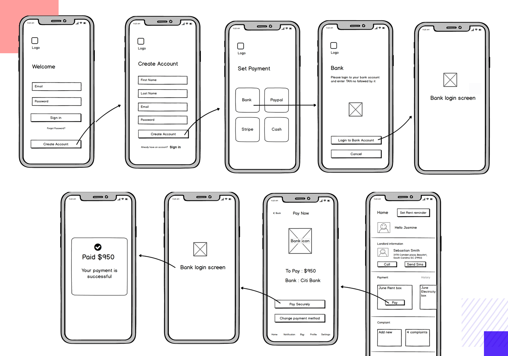

📝**Worth**: 5%

📅 **Due:** From Monday, March 25th to Monday, Apr 8th.

📥 **Submission:** Check-in march 25th + **Demo April 8**

[**Link to Github Classroom Repository**](https://classroom.github.com/a/ZKGepmmw)

### Deliverables:

**By Monday, March 25th before end of class:**

1. Submission of team contract.
2. Team GitHub repository created
3. Jira board created

**By Friday, April 5th before 12:00 AM:**

1. Choice of subsystem per team member.
2. A design document that explains the app you are creating and includes the screen designs. ([Details](https://arefmourtada.github.io/ADIII-W23/#/Project/Project_Milestone1)).
3. Definition of User stories based on the epic user stories and hardware requirements.
   1. User stories identified by the team.
4. App design and feature review before the app Design document is due.

**By Monday, April 8th:**

1. A 10-15 mins meeting with teachers to go over your submission.

### Team Contract

Each group must submit an informal team contract. One contract is submitted for the whole team and should be made available in the team’s GitHub repository for the project **as a markdown file**.

A contract template is included in the GitHub classroom repository for this project and is also available [here](./TeamContractTemplate). It is also found in your project template. 

### Epic User Stories

Below are four [Epic User Stories](https://www.atlassian.com/agile/project-management/epics#:~:text=What%20is%20an%20agile%20epic,over%20a%20set%20of%20sprints.) that should be fulfilled by the end of the project. The epic user stories should guide the creation of **smaller and more specific** user stories for milestone 1 (see next section).

**Farm technician**

1. As the farm technician, I want to know the environmental conditions inside the container in near real-time so that I can make necessary adjustments.

1. As the farm technician, I need to be able to control the environmental conditions inside the container to make sure that plants are healthy.

**Fleet Owner**

1. As the fleet inverter / owner, I want to know the location and placement of the container farms so that I can track company assets.

1. As the fleet owner, I want to be informed of security issues inside the container farm so that I can mobilize an appropriate response.

### Creating of User stories

The project must be organized and managed using the Scrum methodology. Each team is required to define the user stories that they will implement in the course of the project.

The user stories should:

- Be derived from one of the epic user stories described in the previous section.

- Include an Acceptance Criteria section that involves specific hardware requirements (see section [Subsystems & Hardware](https://docs.google.com/document/d/1j5LqHZBLBl-dD95ZVhYK9nrCBShQKbginOflveHvrwM/edit?usp=sharing)).

- Follow the standard:

  *“As a …, I want to …, so that … .”*

- Be small and testable.

- Be independent of other user stories (where possible).

Clarification questions regarding system users should be asked in the Teams for the project. The user descriptions will be further detailed if necessary, according to questions received in Teams.

## Screen Analysis

Define each screen that appears in the app by providing the following:

1. Screen title.
2. A brief description: includes the purpose of the screen and how the end user would use this screen.

## Screen Design 

1. Create a wireframe for each screen: draw how you except each screen to look like. Include buttons, text, and images that the user will see and use.

   - Sketching\Drawing manually: an easy way to start this process is to sketch the screens using index cards to emulate a phone’s screen size. Each app screen should be drawn on a separate notecard. These hand maid sketches can be scanned and used in the report and app final documentation.
   - Digital design: there are different tools that can help you achieve the same task digitally:
     - https://balsamiq.com/
     - https://www.figma.com/
     - https://www.justinmind.com/free-wireframe-tool
     - Microsoft Visio.
     - Microsoft PowerPoint: search for a mobile wireframe PowerPoint template.

2. Screen relations: draw arrows and add notes that show how a user **navigates between the screens.** 

   *For example, if clicking a button takes the user to another screen, draw an arrow between the button and that other screen, or label the lines between the screen with the action that takes the user on that path.*

Here are some inspiration for your app design:

- Telus Smart Home app surveillance system : https://play.google.com/store/apps/details?id=com.alarm.alarmmobile.android.telus&hl=ln&pli=1
- Solar Edge  App solar system surveillance: https://play.google.com/store/apps/details?id=com.solaredge.homeowner
- Blue guard smart home: https://play.google.com/store/apps/details?id=com.archtron.bluguardp2p&hl=en

**Tips:** 

- Use a spiral approach where you start with a very basic design which covers the most important functionality, then progressively app "nice to haves". 

## Design Document 

Write a document to explain the app you are creating and include the screen designs created above. The document must show the app's name and should include the following sections:

- **Functional Overview:** Briefly describe the app in 2-3 sentences.

- **Design Overview:** describe how the app will function in greater detail. Include the description of each screen, as well as screen design, and any information about the navigation between the screens.

- **App Prototype:** Add the created screen analysis and design in the document.

  **DO NOT ADD IMAGES AS A LINK**

- **App Features:** create a list of all features that the app should achieve. start from the user needs we provided. Include all the ideas you have discussed with your teammates even the ones you do not think they will be developed due to lack of time.

  - Organize the features into epic user stories.

  - Then create small (testable) user stories of all the features you have created.

  - Prioritization of Features:

    the user stories (features) must be categorized by priority as:

    - Must develop.
    - Would like to develop.
    - Could develop if time permits.
    - Likely would not develop because of lack time or knowledge.

- **Potential Showstoppers and open ended Questions:** list any problem, question, or concern you may have about this project.

## Rubric

| Evaluation Criteria                                          | Worth (/10pts)                                               |
| :----------------------------------------------------------- | :----------------------------------------------------------- |
| **Team Contract** (breakup details provided in the Course Project document) | **1 point**                                                  |
| **Design Document**                                          |                                                              |
| Functional Overview                                          | **0.5 point**                                                |
| Design overview                                              | **0.5 point**                                                |
| **App Prototype**: includes at least 4 screens Screen analysis includes screen titles and description. Screen design includes wireframe layout. Wireframe layout includes screen relations. | **4 points**  1.5  2  0.5                           |
| **App Features** Features described by user stories collectively cover epic user stories.       Stories follow standard structure (as a, I want to, so that). Stories are small and testable. Stories are independent of other stories where possible. Prioritization of Features *Must Develop* features reflected by the screen design. | **3.5 points**  0.5  0.5  0.5  0.5  0.5  1 |
| **Showstoppers and Open Questions**                          | **0.5 point**                                                |