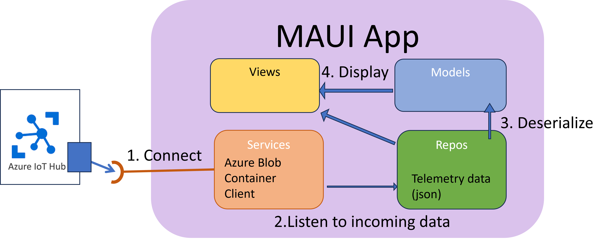

📝**Worth**: 15%

📅 **Due:** May 13-14 Demos. Location: TBD

📥 **Submission:** Code pushed on Repo + Short demo in class:

###### Book your demo time here:

Booking links to be added...

### Introduction

In milestone 3, you have laid the foundation of your app. You created your models and most of your views. In this milestone you will connect and retrieve data from the IoT Hub.

By the end of Milestone 5 your team should deliver the following:

- `.Net Maui` app connects to Azure IoT hub and retrieves data.
- Models updated as per the telemetry.
- Basic data displayed in views.
- The user authentication is implemented

> **Notes**
>
> - **The code organization statements stated below are suggestions to have a better and clean code.**
> - **Your code design could adapt the concepts as is or change them as needed.**

### Authentication 

In this milestone you Login page should be fully functional allowing a user to be authenticated. You do not have to implement a sign in page (this is a nice to have). 

You should also route the user according to who they are (owner or technician). You may simply save a local repo of users with their type. Implementing a database of users is a nice to have. 

Provide the user credentials in your README.md file to allow me to test your app. 

### Connection to Azure IoT Hub

You should start the process of connecting you app to `Azure IoT Hub`. The key objective in this step is to keep the **code as organized as possible**.

Here is a suggestion on how to organize the code: 

**Fixed Values**

- Any fixed data values such as *connection strings*, *server settings*, *credentials*, etc. should be be inside an `appsettings.json` file. You should have a `Config` or `Settings` class which helps deserialize the json. 
- This class (`Config` or `Settings`) should probably be static or instantiated in the `App` class, **so the values can be easily accessed through out the app.**
- Follow variable naming conventions in .NET
- Provide meaningful names.
- Use constants where applicable.

**Handling multiple containers**

- If you are planning for multiple Container-Farms, the instructions above might not be applicable to you, as you will have multiple connection strings, etc.
- In this case, create a model to track each container data (connection strings), if not already done.
- We only expect the app to connect to one container at a time. When the user switches containers, you will have to instantiate the client and the registry manager with the selected container's connection information. 

**Use of Data Repositories**

- Retrieving data from the any source should be done through a data repository class. (similar to the databases lab)
- You app will eventually receive a single telemetry for all subsystems. Start planning for this as you design the repo.
- **Keep in mind OOP abstraction pillar: a single class should describe a single entity and should not include unrelated code.**

**Use of View Models (if applicable)**

- Ensure that your view models are not containing the data, but rather providing public accessors for the data repositories and models. 
- Ensure that the view model of each page is set to be the binding context. 
- It's also preferable to register the View Model and the View as singletons as per [Microsoft's documentation](https://learn.microsoft.com/en-us/dotnet/maui/fundamentals/dependency-injection?view=net-maui-8.0).

### Error handling

**Defensive Programming**: *is a form of defensive design intended to ensure the continuing function of a piece of software under unforeseen circumstances. ([Wikipedia](https://en.wikipedia.org/wiki/Defensive_programming))*

- As you are starting to interact with the cloud, remember that your app should be ready **to handle disruptions **
- Similar to the authentication lab, you should make sure that the user is notified of incorrect credentials and network disruptions. 
- Additionally, data retrieval is dependent on accessing the network. Make sure your code adds `try` and `catch` clauses where needed.
- Refer to [`Network Connectivity`](https://learn.microsoft.com/en-us/dotnet/maui/platform-integration/communication/networking?view=net-maui-7.0&tabs=android) documentation (and the lab on authentication) to check if the network is available before proceeding to connect to any network resource.

### Update of Data Models

In the current `Connected Objects` milestone, the telemetry payload is being well established and **clearly formed**. Revisit the `Models` created in the previous milestone and make any needed adjustments.

### Display of Data

Start the process of connecting the backend, the data, with the frontend user interface.

- Use the data repository classes you have created to retrieve the data.
- Use `Data Binding`to display the data into your views if you have not done already.
  - Display the basic data.
  - Include the units of measurements so that if is at least relevant.
  - Be mindful of real time updates, your views should be notified when the data is changing. 
  - You may start working on advanced views (if you have not already started).
- As you are not required to include information about the actuators in your message, any UI control that is supposed to send data back to the IoT hub is not required to function in this milestone.

### Code Quality & Comments

Refer to Milestone 3 for the details of [Code Quality](https://yobad.github.io/AppDevIII2024/project/milestone3#code-quality) and [Comments](https://yobad.github.io/AppDevIII2024/project/milestone3#comments-and-documentation).

## Deliverables

- Schedule a meeting with me to demonstrate your progress. The booking link was provided [here](https://yobad.github.io/AppDevIII2024/project/milestone5#book-your-demo-time-here).

- **All team members must attend the meeting.**

- Your presentation should not exceed 10 minutes.

- Your presentation should demonstrate:

  - Login 

  - Connection to the IoT Hub

  - Display of real or simulated D2C messages

  - Error handling on network disruptions

    

## Grading Rubric (15 points)

| Evaluation Criteria                                     | Worth        |
| :------------------------------------------------------ | :----------- |
| **Teams Demo**                                          | **5 point**  |
| Login functional                                        | 1 point      |
| Connection to IoT Hub functional                        | 2 point      |
| Organized and prepared.                                 | 1            |
| Respects time limit.                                    | 1            |
| **Error Handling**                                      | **2 point**  |
| Errors at authentication are handled                    | 0.5 point    |
| Errors during data retrieval are handled                | 1.5 point    |
| **Repos**                                               | **2 points** |
| Repos are well organized                                | 0.5          |
| Data retrieved within centralized repo                  | 1 point      |
| Models Updates                                          | 0.5 point    |
| **Services**                                            | **3 points** |
| Authentication - code quality                           | 1 point      |
| IoT Hub Connection - code quality                       | 1 points     |
| IoT Hub Connection strings is centralized               | 1 point      |
| **Views**                                               | **3 points** |
| Data retrieved from Azure IoT Hub and displayed in View | 2 points     |
| Views organized                                         | 1 point      |
| Live updates of the data within views                   | 1 point      |
